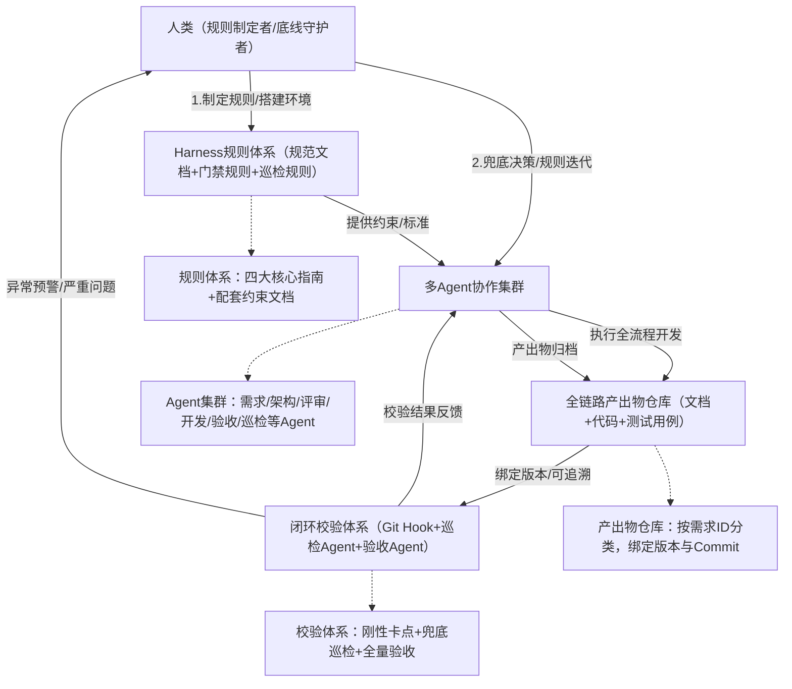
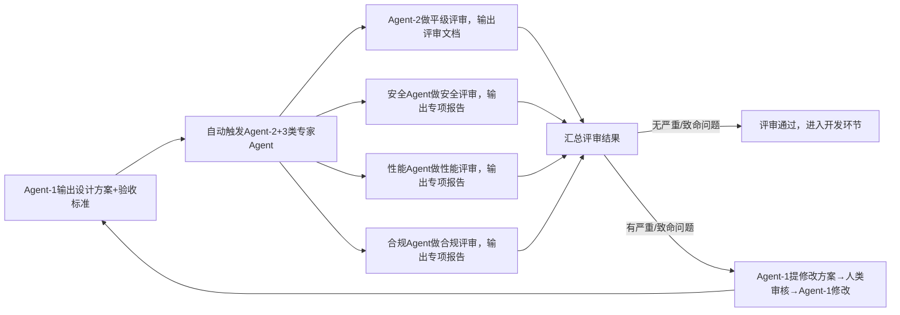

# Agent Harness Engineering驱动下，下一代软件工程的重构与思考（落地实操完整版）

# 前言（落地定位与核心约定）

本文核心定位：**可直接落地的多Agent软件开发实践方案**，基于Agent Harness Engineering（智能体驾驭工程）顶层思想，聚焦「人类制定驾驭规则、多Agent在约束框架内完成全流程开发」的上层落地，不拆解Agent底层运行基座（上下文管理、状态持久化、工具调度、熵收敛等能力均由Agent内生承载）。

本文核心目标：让任何用户（技术管理者、开发工程师）均可按照「全局架构→模块细节→操作步骤→规范文档」的顺序，一步步复刻整套实践方案，无模糊点、无遗漏项、无歧义，所有环节明确「执行主体、操作标准、校验规则、输出物要求」。

核心约定（统一认知，避免落地偏差）：

- 执行主体：人类（规则制定者、环境搭建者、底线守护者）、多智能体（具体执行角色，下文明确分工）；

- 规则载体：所有驾驭规则、校验标准均以「规范文档」形式固化，纳入项目规则库，可直接复用；

- 触发机制：所有流程节点均有明确触发条件（手动触发/自动触发），无“默认执行”模糊表述；

- 校验原则：刚性约束（必须通过，否则阻断流程）+ 柔性评审（优化建议，不阻断）结合；

- 产出物要求：所有Agent/人类产出物均有固定格式、版本规则、归档路径，确保可追溯、可复用。

# 第一部分：全局架构（先懂整体，再落地细节）

## 1.1 核心思想与全局逻辑

本文实践方案的核心逻辑的是 **“人定驾驭规则→Agent受控执行→全链路闭环校验→熵收敛治理”**，完全贴合Agent Harness Engineering“以约束控自主、以规则降风险”的核心思想，打破传统岗位分割壁垒，实现软件开发全流程自动化、标准化、可落地。

核心逻辑拆解：

- 人类：不参与具体执行，仅负责制定规则、搭建环境、兜底决策、迭代规则；

- Agent：在人类制定的规则框架内，分工完成需求转化、架构设计、开发实现、评审验收等全流程执行工作；

- 约束体系：通过规范文档、门禁校验、巡检机制，确保Agent执行不越界、产出不偏离；

- 闭环逻辑：需求→设计→开发→验收→反馈→迭代，每一步均有校验、有记录、可追溯。

## 1.2 全局架构图（可视化理解）

以下架构图明确各角色、各模块的关联关系，落地前需先明确该架构，确保各环节衔接无偏差（可直接用于项目落地参考）：

## 1.3 多Agent角色分工（明确谁来做，做什么）

所有Agent角色均有明确职责、输入输出要求，无模糊分工，落地时直接按以下角色配置即可：

|Agent角色|核心职责|输入（触发条件）|输出物（固定格式）|执行约束|
|---|---|---|---|---|
|Agent-0（需求校准Agent）|将人类口语化需求转化为标准化结构化需求文档|人类口语化需求（文字/语音转文字）、《需求校准指南》|标准化PRD文档（含需求ID、业务边界、非功能指标）|严格遵循《需求校准指南》，不可新增/遗漏需求要点|
|Agent-1（高级架构师Agent）|基于标准化PRD，设计架构方案与验收标准|Agent-0输出的标准化PRD、《方案设计文档编写指南》|架构设计方案、验收标准文档（绑定需求ID、初始版本号）|方案需覆盖所有需求要点，符合项目级技术规范|
|Agent-2（平级评审Agent）|评审Agent-1的架构方案与验收标准，提出修改建议|Agent-1输出的设计方案+验收标准、《设计方案评审指南》|评审文档（含问题分级、修改建议、评审结论）|问题分级需符合“致命/严重/一般/优化”四级标准|
|Agent-3（高级开发Agent）|对齐设计方案，编写代码、预埋单元测试|评审通过的设计方案+验收标准、《设计方案对齐指南》|全量代码、单元测试用例、对齐确认文档（绑定Commit）|代码需符合编码规范，单测通过率需达到预设阈值（如90%）|
|Agent-4（验收Agent）|依据验收标准，执行全维度自动化验收测试|Agent-3输出的代码+测试用例、验收标准文档|验收报告（含测试结果、不通过项、整改建议）|验收需覆盖所有业务/接口/性能/安全场景，无遗漏|
|专家Agent（3类）|补充评审，覆盖安全、性能、合规维度|Agent-1的设计方案、Agent-3的代码|专项评审报告（安全/性能/合规各1份）|严格遵循各专项评审规则，聚焦对应维度风险|
|Agent-5（文档熵收敛巡检Agent）|校验文档与代码的版本联动、锚点一致性，收敛熵增|全链路产出物、《文档熵收敛巡检检查指南》|巡检报告（含差异项、整改建议、分级预警）|每日全量扫描+主干合并后增量扫描，不遗漏异常|
## 1.4 全局落地前置条件（必做，否则无法推进）

落地前需完成以下4项前置工作，所有工作均由人类执行，明确操作标准，确保无遗漏：

1. 环境搭建：搭建Agent运行沙箱（隔离外部环境，避免风险）、代码仓库（配置Git Hook）、产出物仓库（按需求ID分类归档），权限配置为“人类拥有最高权限，Agent仅拥有执行/提交权限，无删除/篡改权限”；

2. 规则文档准备：编写并评审通过本文所有配套规范文档（四大核心指南+3类配套约束文档），上传至产出物仓库“规则库”目录，确保所有Agent可访问、可解析；

3. Agent配置：将所有Agent角色（Agent-0至Agent-5）配置完成，绑定对应规范文档（如Agent-0绑定《需求校准指南》），设置触发条件（如Agent-0由人类手动触发）；

4. 基线标准确定：明确核心基线阈值（如单测通过率≥90%、验收通过率100%方可合并代码），录入门禁规则与巡检规则，确保刚性约束可落地。

# 第二部分：核心模块细节（分步落地，每步有标准）

本部分按“需求→设计→开发→验收→熵治理”的流程顺序，拆解每个模块的落地细节，明确“操作步骤、执行主体、校验标准、异常处理”，确保用户可一步步复刻。

## 模块1：需求标准化转化（落地第一步，无偏差前提）

### 2.1.1 操作步骤（共3步，可直接照做）

1. 人类执行：输出口语化需求（文字形式，无需复杂表述，例：“开发一个用户登录接口，支持手机号+验证码登录，需校验验证码有效期，支持每秒100次并发”），手动触发Agent-0；

2. Agent-0执行：读取《需求校准指南》，拆解口语化需求，补充业务边界（如“不支持第三方登录”）、异常场景（如“验证码错误/过期的提示”）、非功能指标（并发、安全、兼容要求），生成标准化PRD文档；

3. 人类执行：校验标准化PRD文档，确认无偏差（仅校验，不修改），确认后标注“需求确认通过”，绑定唯一需求ID（格式：REQ-年份-序号，例：REQ-2026-001），上传至产出物仓库“需求文档”目录，触发下一步流程。

### 2.1.2 校验标准（刚性约束，必须满足）

- 标准化PRD文档必须包含：需求ID、需求描述、业务边界、异常场景、非功能指标（性能/安全/兼容）、交付时限，缺一不可；

- 需求ID格式统一，无重复、无遗漏，与后续所有关联文档/代码绑定；

- 无模糊表述（如“并发尽量高”需明确为“每秒并发≥100次”）。

### 2.1.3 异常处理

若人类校验发现PRD文档不符合要求：手动驳回给Agent-0，附带具体修改建议（例：“补充验证码有效期的具体数值”），Agent-0重新生成，直至通过校验。

## 模块2：架构设计与多维度评审（核心环节，把控质量）

### 2.2.1 操作步骤（共5步，顺序不可乱）

1. 自动触发：需求PRD确认通过后，自动触发Agent-1；

2. Agent-1执行：读取标准化PRD、《方案设计文档编写指南》，输出架构设计方案（含拓扑图、技术选型、核心流程）和验收标准文档，绑定需求ID、初始版本号（格式：V1.0.0），提交至代码仓库；

3. 自动触发：Agent-1提交完成后，自动触发Agent-2（平级评审）和3类专家Agent（安全/性能/合规），同步开展评审；

4. 多Agent评审：Agent-2输出平级评审文档，3类专家Agent分别输出专项评审文档，所有评审文档均标注问题分级（致命/严重/一般/优化）；

5. 人类+Agent协同：Agent-1读取所有评审文档，自动修改“一般/优化”级问题；“严重/致命”级问题由Agent-1提出修改方案，人类审核确认后，Agent-1完成修改，重新提交评审，直至所有评审结论为“通过”。

### 2.2.2 评审流程流程图（可视化步骤）

### 2.2.3 校验标准（刚性约束）

- 架构设计方案必须覆盖PRD所有需求，技术选型符合项目级规范（如指定Java语言、MySQL数据库）；

- 验收标准文档必须可自动化执行（所有指标可量化，例：“接口响应时间≤500ms”），无模糊验收项；

- 评审通过标准：无致命/严重问题，一般问题≤3个，优化问题不影响核心功能。

### 2.2.4 异常处理

- 若评审出现致命问题（如架构无法满足并发需求）：Agent-1重新设计架构方案，人类全程介入指导，直至评审通过；

- 若多Agent评审出现分歧（如Agent-2与安全Agent对某一设计有不同意见）：由人类兜底裁决，明确最终方案，记录裁决结果，纳入知识库。

## 模块3：开发对齐与代码实现（落地核心，确保可交付）

### 2.3.1 操作步骤（共4步，含门禁卡点）

1. 自动触发：架构评审通过后，自动触发Agent-3；

2. Agent-3执行：读取评审通过的设计方案、验收标准、《设计方案对齐指南》，梳理模糊点/争议点，输出对齐确认文档，无模糊点后，开始编写代码、预埋单元测试；

3. 门禁校验（Git Hook）：Agent-3提交代码前，触发pre-commit钩子，自动校验代码风格、单测通过率、编译正确性，校验通过方可提交；提交后，触发pre-push钩子，校验代码与设计方案的一致性，通过后方可推送至主干；

4. 归档：代码推送成功后，Agent-3自动将代码、单元测试用例、对齐确认文档，绑定需求ID、架构版本、Commit信息，上传至产出物仓库“代码与测试”目录，触发下一步验收流程。

### 2.3.2 校验标准（刚性约束，阻断性）

- 代码规范：严格遵循项目级编码规范（如命名规则、注释要求），Linter校验无错误；

- 单测要求：单元测试覆盖率≥90%，所有单测用例执行通过；

- 一致性要求：代码逻辑、接口设计与架构方案完全一致，无偏离；

- Commit规范：Commit信息格式统一（例：“【REQ-2026-001】完成登录接口开发，单测通过”），绑定需求ID。

### 2.3.3 异常处理

- 门禁校验不通过：Git Hook自动弹窗提示具体问题（例：“单测覆盖率仅85%，需补充用例”），Agent-3修改后重新提交，直至通过；

- 代码与设计方案存在偏差：Agent-2自动介入复核，提出修改建议，Agent-3修改后重新校验。

## 模块4：自动化验收与全流程闭环（落地收尾，确保可交付）

### 2.4.1 操作步骤（共4步，全自动化为主）

1. 自动触发：代码推送至主干后，自动触发Agent-4；

2. Agent-4执行：读取验收标准文档、代码、单元测试用例，自动执行全维度验收测试（业务场景、接口性能、安全合规、兼容性），生成验收报告；

3. 结果判断：验收报告显示“全量通过”→ 自动执行CI构建、版本打标（格式：V1.0.0-REQ-2026-001），完成交付；验收报告显示“存在不通过项”→ 自动反馈给Agent-3，Agent-3根据整改建议修改代码，重新提交验收；

4. 人工兜底：若验收出现无法自动整改的问题（如验收标准不合理），Agent-4自动预警，人类介入调整验收标准或指导Agent-3整改，直至验收通过。

### 2.4.2 验收维度明细（无遗漏，可直接复用）

|验收维度|校验内容|量化标准（示例）|执行主体|
|---|---|---|---|
|业务验收|正向场景、异常场景、边界场景|所有场景执行成功，无报错|Agent-4|
|接口验收|入参校验、出参格式、错误码、接口稳定性|接口响应时间≤500ms，错误码符合规范|Agent-4|
|性能验收|并发量、吞吐量、资源占用|并发≥100QPS，CPU占用≤70%，内存占用≤800M|Agent-4+性能专家Agent|
|安全验收|权限校验、数据脱敏、防注入、漏洞扫描|无安全漏洞，敏感数据（如手机号）脱敏显示|Agent-4+安全专家Agent|
|兼容性验收|不同环境（开发/测试/预生产）、不同版本依赖|所有环境均可正常运行，无依赖冲突|Agent-4|
### 2.4.3 异常处理

- 验收不通过（代码问题）：Agent-3自动读取整改建议，修改代码后重新提交验收，最多可重试3次，3次仍不通过，触发人类介入；

- 验收不通过（验收标准问题）：人类修改验收标准文档，重新触发Agent-4验收，修改记录绑定需求ID，纳入版本追溯。

## 模块5：文档全链路版本联动与熵收敛治理（长效保障，避免偏差）

本模块核心解决“文档与代码脱节、信息偏差”问题，落地双机制校验，所有细节明确可操作，补充完整的巡检指南，确保用户可直接复用。

### 2.5.1 核心落地机制（双保险，必做）

采用「Git Hook强卡点 + 专属巡检Agent兜底」双机制，确保文档与代码联动同步，具体操作如下：

1. 机制1：Git Hook（pre-commit/pre-push）即时校验（刚性拦截）        

2. 触发时机：任何Agent/人类修改文档（PRD、设计方案、验收标准）或代码时，提交瞬间触发；

3. 校验内容：当前修改文件绑定的需求ID、架构版本、Commit信息，是否与全链路关联文档一致；

4. 处置逻辑：若发现关联文档未同步、版本错位、ID不一致 → 直接阻断提交，弹窗提示“需同步修改关联文档（例：修改PRD后，需同步更新架构设计方案V1.0.1）”，强制完成对齐后，方可提交。

5. 机制2：Agent-5（文档熵收敛巡检Agent）兜底巡检        

6. 触发方式：每日固定时间（如22:00）执行全量扫描；任何文档/代码合并至主干时，自动触发增量扫描；

7. 校验内容：严格遵循《文档熵收敛巡检检查指南》，校验全链路产出物的锚点一致性、版本递进、变更联动；

8. 处置逻辑：生成《文档熵偏离巡检报告》，标红差异项、关联责任人（对应Agent）、给出具体修改建议；致命/严重项自动预警，进入人工复核池；一般/优化项仅预警，纳入下次迭代整改。

### 2.5.2 巡检Agent核心校验标准（可直接写入指南，Agent可解析）

#### （一）刚性校验基线（必须满足，否则触发预警/拦截）

- ID唯一绑定规则：所有产出物（文档/代码/测试用例）必须绑定1个有效需求ID，禁止无ID、多ID、过期ID、伪造ID；

- 版本递进规则：架构版本升级（如V1.0.0→V1.0.1），所有关联的设计文档、验收标准、测试用例必须同步升级版本号，旧版本自动标灰归档，禁止基于旧版本产出新内容；

- Commit锚点规则：设计文档标注的基准Commit，必须与主干当前生效Commit一致；代码内注释、接口契约，必须能回溯到对应架构文档段落；

- 变更联动规则：修改以下任意一项，全链路关联文档必须同步复核修改：①业务边界增减；②非功能指标调整；③核心数据结构/接口字段变更；④验收标准阈值修改。

#### （二）问题分级标准（与评审分级一致，可直接复用）

- 致命：需求ID错位、核心变更未同步、Commit锚点篡改 → 阻断合并、紧急整改（24小时内）；

- 严重：版本号不递进、关联文档漏更新 → 限期整改（48小时内），禁止新增功能基于旧文档；

- 一般：备注/说明类文案不同步 → 纳入下次迭代统一修复；

- 优化：格式、索引、引用排版不规范 → 仅预警，不拦截，按需整改。

### 2.5.3 《文档熵收敛巡检检查指南》（完整可落地版，直接复用）

本指南为Agent-5与Git Hook校验引擎的核心约束手册，纳入项目规则库，全文可直接复制使用：

#### 《文档全链路联动&熵收敛巡检检查指南》

##### 1. 总则与适用范围

1.1 目的：管控需求、设计、文档、代码的信息偏差，收敛全流程熵增，确保全链路产出物一致、可追溯，支撑多Agent协同落地；

1.2 适用范围：本文档适用于本项目所有Agent产出的文档（PRD、架构设计、验收标准等）、代码、单元测试用例、评审报告，以及人类修改的所有相关产出物；

1.3 责任主体：Agent-5（文档熵收敛巡检Agent）负责执行巡检，人类负责制定规则、复核严重问题、审批例外情况。

##### 2. 基础绑定规范（强制执行）

2.1 文档绑定要求：所有文档头部必须包含以下必填字段（不可遗漏、不可篡改）：

- 需求ID：格式为REQ-年份-序号（例：REQ-2026-001）；

- 关联架构版本：格式为Vx.y.z（例：V1.0.0）；

- 基准Commit：填写对应代码的Commit Hash（完整64位）；

- 生效时间：格式为YYYY-MM-DD（例：2026-03-28）；

- 上版迭代号：若为迭代版本，填写上一版本号（例：V1.0.0），初始版本填写“无”。

2.2 代码绑定要求：代码仓库根目录必须存放“版本映射表.xlsx”，记录需求ID→架构版本→文档路径→Commit Hash的关联关系，每次变更后自动更新；

2.3 归档规范：所有产出物按“需求ID/文档类型”分类归档（例：REQ-2026-001/PRD、REQ-2026-001/架构设计），禁止乱堆乱放。

##### 3. 触发校验时机规范

- pre-commit触发：单文件（文档/代码）变更提交时，触发锚点一致性基础校验（仅校验当前文件的需求ID、版本号）；

- pre-push触发：文件推送至分支时，触发全链路关联校验（校验当前文件与所有关联文档/代码的一致性）；

- 主干合并触发：文件合并至主干时，触发增量联动校验（仅校验变更部分的关联关系）；

- 定时触发：每日22:00，触发全量基线巡检（校验所有产出物的绑定关系、版本递进、变更联动）。

##### 4. 逐条校验规则明细（Agent可直接解析）

- 规则001：所有产出物必须绑定唯一有效需求ID，无ID、多ID、过期ID、伪造ID，均判定为致命问题；

- 规则002：架构版本升级后，关联的设计文档、验收标准、测试用例必须在24小时内同步升级版本号，否则判定为严重问题；

- 规则003：设计文档标注的基准Commit，与主干当前生效Commit不一致，判定为严重问题；

- 规则004：修改业务边界、非功能指标、核心数据结构、验收标准后，未同步修改关联文档/代码，判定为致命问题；

- 规则005：代码内注释、接口契约，无法回溯到对应架构文档段落，判定为一般问题；

- 规则006：文档格式、索引、引用排版不规范（如字段缺失、排版混乱），判定为优化问题；

- 规则007：旧版本文档未标灰归档，仍被用于新增功能开发，判定为严重问题；

- 规则008：版本映射表未及时更新，判定为一般问题，需在24小时内更新。

##### 5. 问题分级与处置流程

|问题分级|处置方式|整改时限|责任主体|
|---|---|---|---|
|致命|阻断提交/合并，自动预警，进入人工复核池，强制整改|24小时内|对应执行Agent+人类复核|
|严重|预警提示，禁止基于旧文档新增功能，限期整改|48小时内|对应执行Agent|
|一般|仅预警，不阻断，纳入下次迭代统一整改|下次迭代前|对应执行Agent|
|优化|仅预警，不阻断，按需整改|无强制时限|对应执行Agent|
##### 6. 巡检报告输出规范

6.1 报告模板（固定格式，不可修改）：

- 标题：《文档熵收敛巡检报告-巡检时间-需求ID（全量/增量）》（例：《文档熵收敛巡检报告-20260328-全量》）；

- 核心内容：①巡检概况（巡检范围、巡检时长、异常项总数）；②差异清单（问题分级、问题描述、关联产出物路径、关联需求ID）；③整改建议（具体修改操作、责任Agent）；④整改时限；

6.2 报告归档：巡检报告绑定对应需求ID（全量报告绑定“全量”标识），上传至产出物仓库“巡检报告”目录，可追溯、可查询；

6.3 预警方式：致命/严重问题通过系统弹窗+邮件通知人类，一般/优化问题仅在报告中标注。

##### 7. 例外审批规则（仅人类可操作）

7.1 例外场景（仅以下场景可申请例外，其余场景不可豁免）：

- 极小文案优化（如修改文档错别字），不影响核心内容与关联关系；

- 非关联注释调整（如代码内注释优化，不涉及逻辑与接口）；

7.2 审批流程：人类提交例外申请（注明申请理由、关联产出物、修改内容），记录豁免记录，留痕审计，豁免有效期最长为7天，过期自动失效。

### 2.5.4 异常处理

- 巡检发现致命问题：Agent-5自动阻断相关提交/合并，预警人类，对应Agent在24小时内整改，人类复核通过后，解除阻断；

- 关联文档同步不及时：Agent-5自动提醒对应Agent，逾期未整改的，升级为严重问题，触发人类介入；

- 例外申请审批：人类需在24小时内完成审批，审批结果同步至Agent-5，纳入巡检记录。

# 第三部分：配套规范文档（全量可复用，直接落地）

本部分整理项目落地所需的所有规范文档，除上文已完整提供的《文档熵收敛巡检检查指南》外，补充其余6类核心规范文档的完整目录与核心内容，用户可直接复制、完善细节后使用。

## 3.1 四大核心指南文档（Agent执行核心依据）

### 3.1.1 《方案设计文档编写指南》（供Agent-1使用）

#### 核心目录（必含模块，不可遗漏）：

1. 文档基础信息（需求ID、关联版本、基准Commit、生效时间）；

2. 需求溯源（关联标准化PRD ID、核心业务目标、需求优先级）；

3. 边界定义（明确“做什么、不做什么”，无模糊表述）；

4. 整体架构（架构拓扑图、模块拆分、数据流图，可视化）；

5. 技术选型（框架、存储、中间件，明确选型理由，符合项目级规范）；

6. 核心数据结构（数据库表设计、核心实体类、接口契约）；

7. 非功能设计（性能、安全、容灾、兼容要求，可量化）；

8. 风险预案（潜在风险、应对措施、责任人）；

9. 附录（术语定义、依赖清单、参考文档）。

### 3.1.2 《验收标准文档编写指南》（供Agent-4使用）

#### 核心目录（必含模块，不可遗漏）：

1. 文档基础信息（需求ID、关联架构版本、基准Commit）；

2. 验收总则（验收范围、验收标准、验收工具、验收责任人）；

3. 业务验收（正向场景、异常场景、边界场景，每条均有可执行步骤）；

4. 接口验收（入参校验规则、出参格式、错误码规范、接口稳定性要求）；

5. 性能验收（并发量、吞吐量、响应时间、资源占用的量化阈值）；

6. 安全验收（权限校验、数据脱敏、防注入、漏洞扫描标准）；

7. 兼容性验收（环境兼容、版本兼容、依赖兼容要求）；

8. 自动化用例（可直接生成测试脚本，明确执行逻辑）；

9. 验收结果判定标准（全量通过条件、不通过整改要求）。

### 3.1.3 《设计方案评审文档编写指南》（供Agent-2使用）

#### 核心目录（必含模块，不可遗漏）：

1. 文档基础信息（需求ID、关联设计文档版本、评审时间、评审Agent）；

2. 评审基线（绑定设计文档版本、评审范围、评审标准）；

3. 评审维度打分（架构合理性、可扩展性、安全性、可落地性，满分100分，80分及以上通过）；

4. 问题分级明细（致命/严重/一般/优化，每条问题需含：原文引用、风险说明、修改建议）；

5. 评审结论（通过/不通过，不通过需注明核心原因）；

6. 评审追溯（评审Agent签名、复核人签名、评审记录归档路径）。

### 3.1.4 《设计方案对齐确认文档编写指南》（供Agent-3使用）

#### 核心目录（必含模块，不可遗漏）：

1. 文档基础信息（需求ID、关联设计文档版本、对齐时间）；

2. 待确认疑问清单（梳理设计方案中的模糊点、争议点，逐条列出）；

3. 逐条答疑（针对疑问，给出明确答案，绑定设计方案对应段落）；
