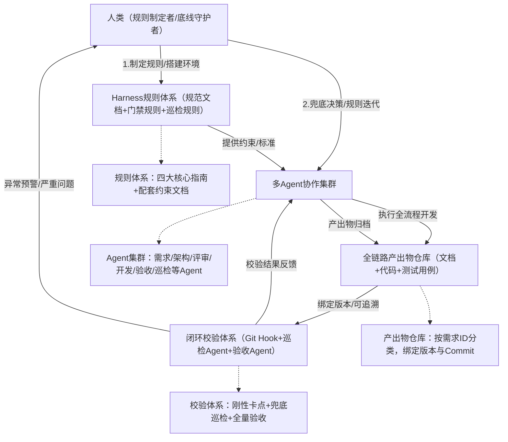
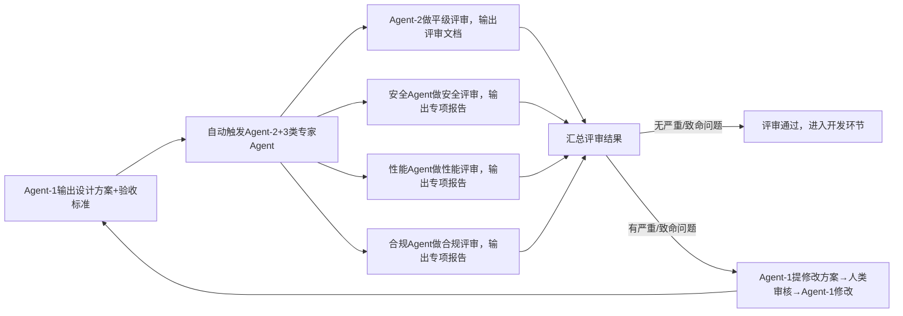

# Agent Harness Engineering驱动下，下一代软件工程的重构与思考（落地实操完整版）

# 前言（落地定位与核心约定）

本文核心定位：**可直接落地的多Agent软件开发实践方案**，基于Agent Harness Engineering（智能体驾驭工程）顶层思想，聚焦「人类制定驾驭规则、多Agent在约束框架内完成全流程开发」的上层落地，不拆解Agent底层运行基座（上下文管理、状态持久化、工具调度、熵收敛等能力均由Agent内生承载）。

本文核心目标：让任何用户（技术管理者、开发工程师）均可按照「全局架构→模块细节→操作步骤→规范文档」的顺序，一步步复刻整套实践方案，无模糊点、无遗漏项、无歧义，所有环节明确「执行主体、操作标准、校验规则、输出物要求」。

核心约定（统一认知，避免落地偏差）：

- 执行主体：人类（规则制定者、环境搭建者、底线守护者）、多智能体（具体执行角色，下文明确分工）；

- 规则载体：所有驾驭规则、校验标准均以「规范文档」形式固化，纳入项目规则库，可直接复用；

- 触发机制：所有流程节点均有明确触发条件（手动触发/自动触发），无"默认执行"模糊表述；

- 校验原则：刚性约束（必须通过，否则阻断流程）+ 柔性评审（优化建议，不阻断）结合；

- 产出物要求：所有Agent/人类产出物均有固定格式、版本规则、归档路径，确保可追溯、可复用。

# 第一部分：全局架构（先懂整体，再落地细节）

## 1.1 核心思想与全局逻辑

本文实践方案的核心逻辑的是 **"人定驾驭规则→Agent受控执行→全链路闭环校验→熵收敛治理"**，完全贴合Agent Harness Engineering"以约束控自主、以规则降风险"的核心思想，打破传统岗位分割壁垒，实现软件开发全流程自动化、标准化、可落地。

核心逻辑拆解：

- 人类：不参与具体执行，仅负责制定规则、搭建环境、兜底决策、迭代规则；

- Agent：在人类制定的规则框架内，分工完成需求转化、架构设计、开发实现、评审验收等全流程执行工作；

- 约束体系：通过规范文档、门禁校验、巡检机制，确保Agent执行不越界、产出不偏离；

- 闭环逻辑：需求→设计→开发→验收→反馈→迭代，每一步均有校验、有记录、可追溯。

**关于规约体系的动态演进观**：规约指南体系并非一成不变的静态文档集合，而是随模型与Agent能力持续演进的动态框架。当前阶段，规范文档承担着"外化约束"的核心职能——将人类经验、业务判断、质量标准显式化，以弥补Agent在特定领域的能力短板。随着模型能力的迭代提升，部分指南规则会被Agent内化为默认行为（如代码风格校验、文档格式规范等），无需显式约束即可自动达标；届时，对应的规范文档可逐步简化乃至退出规则库。**因此，规约体系的"减重"是能力演进的自然结果，而非目标本身——当前阶段的合理做法，是让规约足够清晰、可执行，同时保持对Agent能力边界的持续观察，及时精简已被内化的规则，聚焦仍需外部约束的高价值环节。**

**规约减重的判断标准**：判断某条规则是否具备减重条件，需同时满足以下三个维度的评估，缺一不可：

- **行为稳定性**：该规则所约束的行为，Agent在连续 N 个需求（建议阈值：≥10个，含不同类型需求）中均自主达标，无需规则提示、无人工干预、无回退；单次偶然达标不构成减重依据；

- **泛化覆盖性**：Agent的达标表现须覆盖该规则的全部约束场景（含正常场景、边界场景、异常场景），而非仅在典型路径下表现良好；若存在某类场景的稳定偏差，规则不可减重；

- **失效可感知**：即便移除规则约束，一旦Agent在该维度出现偏差，现有校验体系（门禁、巡检、验收）能够及时捕获并触发预警，确保无规则兜底时偏差不会静默扩散。

满足上述三个条件后，执行减重操作前还需完成以下确认：

1. **规则归档，不删除**：将待减重规则从"执行约束"降级为"历史参考"，保留在规则库的归档区，注明减重时间与触发原因，以备能力退化时快速恢复；
2. **灰度退出**：先在单个需求中移除规则观察一个完整交付周期，确认无异常后再全量退出，避免批量减重引发连锁失控；
3. **人类终审**：减重决策须由人类（技术负责人）最终确认，Agent可发起减重提案，但无权自行执行。减重提案须使用以下标准模板：

```markdown
## 规约减重提案

### 基本信息
- 提案ID：SLIM-{年份}-{序号}（例：SLIM-2026-001）
- 提案时间：YYYY-MM-DD
- 提案发起方：{Agent名称 / 人类姓名}
- 目标规则：{规则所在指南名称} - {规则编号/名称}（例：《需求校准指南》- 规则003）
- 规则当前状态：执行约束

### 规则原文
（完整引用待减重规则的原始表述，不可摘要，不可改写）

### 三维评估结果

#### 1. 行为稳定性
- 评估周期内需求总数：{N} 个（需 ≥10，列出需求ID）
- 需求类型覆盖：{列出已覆盖的需求类型，如：接口开发/数据迁移/性能优化等}
- 达标情况：全部自主达标 / 存在以下例外（列出例外需求ID及偏差描述）
- 是否有人工干预记录：有 / 无（有则列出干预时间与原因）

#### 2. 泛化覆盖性
- 正常场景覆盖：已覆盖 / 未覆盖（说明缺口）
- 边界场景覆盖：已覆盖 / 未覆盖（说明缺口）
- 异常场景覆盖：已覆盖 / 未覆盖（说明缺口）
- 存在已知覆盖盲区：有 / 无（有则描述）

#### 3. 失效可感知
- 偏差捕获机制：{列出可兜底的校验环节，如：pre-commit门禁 / Agent-5巡检 / 验收Agent}
- 兜底验证方式：{说明如何验证上述机制确实能捕获该规则失效，如：已构造失效用例并确认触发告警}
- 静默扩散风险评估：低 / 中 / 高（高风险不可减重）

### 减重方式建议
- [ ] 完全退出：从执行约束移至归档区，不再触发校验
- [ ] 降级保留：保留规则文本，但将校验级别从"阻断"降为"预警"
- [ ] 范围收窄：仅在特定场景下保留约束，其余场景退出

### 佐证材料
- 关联需求ID列表：{REQ-xxxx-xxx, ...}
- 相关巡检报告路径：{docs/...}
- 其他参考记录：{如有，列出路径}

### 风险提示
（说明减重后可能残留的风险点及已有的应对措施）

### 审批记录
- 审批人：
- 审批时间：
- 审批结论：通过 / 驳回 / 延期
- 驳回/延期原因：（如适用）
- 生效时间：（审批通过后填写）
```

**减重提案归档路径规范**：

| 文件类型 | 归档路径 | 命名规则 | 归档时机 |
|----------|----------|----------|----------|
| 减重提案文件 | `docs/slim/proposals/` | `{提案ID}.md`（例：`SLIM-2026-001.md`） | 提案提交时立即归档，审批结论填入后原地更新，不另存新文件 |
| 归档规则原文 | `docs/slim/archived-rules/` | `{提案ID}-rule.md`（例：`SLIM-2026-001-rule.md`） | 审批通过、减重正式生效后 24 小时内归档 |

归档文件内容要求：

- **提案文件**（`proposals/{提案ID}.md`）：即上方完整提案模板，含审批记录，一次归档终身有效，仅追加，不覆盖；
- **归档规则文件**（`archived-rules/{提案ID}-rule.md`）：包含三段内容，依次为：①规则原文（完整复制自原指南，注明来源路径与原始版本号）；②减重记录（提案ID、减重时间、减重方式、审批人）；③恢复记录（若曾恢复，按时间顺序追加每次恢复的触发情形、根因结论、恢复时间、操作人，不限条数）。

索引维护：`docs/slim/` 目录下须维护一份 `slim-index.md` 索引文件，统一记录减重提案（`SLIM-`）与增重提案（`ENRICH-`）的状态汇总，格式如下：

```markdown
## 规约提案索引

| 提案ID | 提案类型 | 目标指南/规则 | 提案时间 | 当前状态 | 生效时间 | 最近恢复时间 |
|--------|----------|---------------|----------|----------|----------|--------------|
| SLIM-2026-001 | 减重 | 《需求校准指南》- 规则003 | 2026-03-28 | 已减重 | 2026-04-01 | - |
| SLIM-2026-002 | 减重 | 《方案设计文档编写指南》- 规则005 | 2026-04-10 | 已恢复 | 2026-04-15 | 2026-05-02 |
| ENRICH-2026-001 | 增重 | 《方案设计文档编写指南》- 规则009（新增） | 2026-04-20 | 已生效 | 2026-04-25 | - |
| ENRICH-2026-002 | 增重 | 《验收标准文档编写指南》- 第5章（新增章节） | 2026-05-01 | 审批中 | - | - |
```

`slim-index.md` 由操作人在每次提案提交、审批完成、生效或恢复触发后同步更新；Agent-5 巡检时校验索引与实际文件的一致性，不一致判定为一般问题。

**slim-index.md 变更触发校验规则**：对 `slim-index.md` 的任何修改均须通过以下校验，校验由 Git Hook 在 pre-commit 阶段自动执行，不通过则阻断提交：

- **规则S-001（提案文件存在性）**：索引中每条记录的提案ID，必须在 `docs/slim/proposals/` 下存在对应的 `{提案ID}.md` 文件；索引有记录而文件缺失，判定为致命问题，阻断提交；

- **规则S-002（归档文件一致性）**：索引中状态为"已减重"或"已恢复"的记录，必须在 `docs/slim/archived-rules/` 下存在对应的 `{提案ID}-rule.md` 文件；文件缺失判定为严重问题，阻断提交；

- **规则S-003（状态合法性）**：索引中"当前状态"字段仅允许以下合法值：减重提案（`SLIM-`）合法值为 `审批中` / `已减重` / `已恢复` / `已驳回`；增重提案（`ENRICH-`）合法值为 `审批中` / `已生效` / `已驳回`；出现其他值判定为一般问题，阻断提交；

- **规则S-004（时间字段完整性）**：减重提案状态为"已减重"时，"生效时间"字段不可为空；减重提案状态为"已恢复"时，"最近恢复时间"字段不可为空；增重提案状态为"已生效"时，"生效时间"字段不可为空；字段为空判定为严重问题，阻断提交；

- **规则S-005（禁止删行）**：`slim-index.md` 的历史记录行不可删除，只可追加或修改状态字段；若本次提交导致已有记录行数减少，判定为致命问题，阻断提交；

- **规则S-006（索引与提案文件状态一致）**：索引中记录的"当前状态"须与对应提案文件中"审批结论"字段保持一致，映射关系按提案类型分别约定：减重提案（`SLIM-`）：审批结论为空→`审批中`，通过→`已减重`，驳回→`已驳回`，已恢复→`已恢复`；增重提案（`ENRICH-`）：审批结论为空→`审批中`，通过且灰度验证通过→`已生效`，驳回→`已驳回`；不一致判定为严重问题，阻断提交。

上述规则的问题分级与处置方式与全局分级标准一致（致命：24小时内整改；严重：48小时内整改）；Agent-5 每日全量巡检时同步复核上述规则，发现存量问题按相同分级处置。

**Git Hook 校验脚本示例**：以下脚本实现 S-001 至 S-006 全部校验规则，放置于项目根目录 `.git/hooks/pre-commit`，赋予可执行权限（`chmod +x .git/hooks/pre-commit`）后自动生效：

```bash
#!/usr/bin/env bash
# slim-index 校验脚本 —— 实现规则 S-001 至 S-006
# 仅在本次提交涉及 docs/slim/ 下的文件时触发

set -euo pipefail

SLIM_DIR="docs/slim"
PROPOSALS_DIR="${SLIM_DIR}/proposals"
ARCHIVED_DIR="${SLIM_DIR}/archived-rules"
INDEX_FILE="${SLIM_DIR}/slim-index.md"

# 检查本次提交是否涉及 slim 相关文件，无关则跳过
CHANGED=$(git diff --cached --name-only)
if ! echo "${CHANGED}" | grep -q "^docs/slim/"; then
  exit 0
fi

ERRORS=()    # 致命/严重问题，阻断提交
WARNINGS=()  # 一般问题，阻断提交（按规则 S-003）

# ── 工具函数 ──────────────────────────────────────────────

# 从 slim-index.md 提取数据行（跳过表头与分隔行，同时匹配 SLIM- 与 ENRICH-）
parse_index_rows() {
  grep -E "^\| (SLIM|ENRICH)-" "${INDEX_FILE}" 2>/dev/null || true
}

# 从提案文件中提取"审批结论"字段值
get_proposal_conclusion() {
  local proposal_file="$1"
  grep -E "^- 审批结论：" "${proposal_file}" 2>/dev/null \
    | sed 's/- 审批结论：//' \
    | sed 's/（如适用）//' \
    | tr -d ' ' \
    | head -1
}

# 将审批结论映射为索引状态（按提案类型分别映射）
map_conclusion_to_status() {
  local conclusion="$1"
  local proposal_id="$2"
  # 增重提案（ENRICH-）映射
  if [[ "${proposal_id}" == ENRICH-* ]]; then
    case "${conclusion}" in
      "通过")    echo "已生效" ;;
      "驳回"*)   echo "已驳回" ;;
      "延期"*)   echo "审批中" ;;
      "")        echo "审批中" ;;
      *)         echo "UNKNOWN" ;;
    esac
  # 减重提案（SLIM-）映射
  else
    case "${conclusion}" in
      "通过")    echo "已减重" ;;
      "驳回"*)   echo "已驳回" ;;
      "延期"*)   echo "审批中" ;;
      "已恢复")  echo "已恢复" ;;
      "")        echo "审批中" ;;
      *)         echo "UNKNOWN" ;;
    esac
  fi
}

# ── S-005：禁止删行检测 ────────────────────────────────────
if git show HEAD:"${INDEX_FILE}" > /tmp/slim_index_old.md 2>/dev/null; then
  OLD_COUNT=$(grep -cE "^\| (SLIM|ENRICH)-" /tmp/slim_index_old.md || echo 0)
  NEW_COUNT=$(grep -cE "^\| (SLIM|ENRICH)-" "${INDEX_FILE}" || echo 0)
  if [ "${NEW_COUNT}" -lt "${OLD_COUNT}" ]; then
    ERRORS+=("[致命][S-005] slim-index.md 记录行数减少（原 ${OLD_COUNT} 行，现 ${NEW_COUNT} 行），禁止删除历史记录")
  fi
fi

# ── 逐行校验 S-001 至 S-004、S-006 ───────────────────────
# 注意：索引新增"提案类型"列，字段顺序为：提案ID | 提案类型 | 目标指南/规则 | 提案时间 | 当前状态 | 生效时间 | 最近恢复时间
while IFS='|' read -r _ proposal_id proposal_type target_rule proposal_time status effect_time restore_time _; do
  # 去除首尾空格
  proposal_id=$(echo "${proposal_id}" | tr -d ' ')
  proposal_type=$(echo "${proposal_type}" | tr -d ' ')
  status=$(echo "${status}" | tr -d ' ')
  effect_time=$(echo "${effect_time}" | tr -d ' ')
  restore_time=$(echo "${restore_time}" | tr -d ' ')

  [ -z "${proposal_id}" ] && continue

  proposal_file="${PROPOSALS_DIR}/${proposal_id}.md"
  archived_file="${ARCHIVED_DIR}/${proposal_id}-rule.md"

  # S-001：提案文件存在性
  if [ ! -f "${proposal_file}" ]; then
    ERRORS+=("[致命][S-001] ${proposal_id}：提案文件不存在（期望路径：${proposal_file}）")
  fi

  # S-002：归档文件一致性（减重提案才需要归档规则文件）
  if [[ "${proposal_type}" == "减重" ]]; then
    if [[ "${status}" == "已减重" || "${status}" == "已恢复" ]]; then
      if [ ! -f "${archived_file}" ]; then
        ERRORS+=("[严重][S-002] ${proposal_id}：减重提案状态为\"${status}\"但归档规则文件不存在（期望路径：${archived_file}）")
      fi
    fi
  fi

  # S-003：状态合法性（按提案类型分别校验合法值）
  if [[ "${proposal_type}" == "减重" ]]; then
    case "${status}" in
      "审批中"|"已减重"|"已恢复"|"已驳回") ;;
      *) WARNINGS+=("[一般][S-003] ${proposal_id}：减重提案状态值\"${status}\"非法，合法值为：审批中/已减重/已恢复/已驳回") ;;
    esac
  elif [[ "${proposal_type}" == "增重" ]]; then
    case "${status}" in
      "审批中"|"已生效"|"已驳回") ;;
      *) WARNINGS+=("[一般][S-003] ${proposal_id}：增重提案状态值\"${status}\"非法，合法值为：审批中/已生效/已驳回") ;;
    esac
  fi

  # S-004：时间字段完整性
  if [[ "${status}" == "已减重" || "${status}" == "已生效" ]]; then
    if [[ -z "${effect_time}" || "${effect_time}" == "-" ]]; then
      ERRORS+=("[严重][S-004] ${proposal_id}：状态为\"${status}\"但生效时间为空")
    fi
  fi
  if [[ "${status}" == "已恢复" && ( -z "${restore_time}" || "${restore_time}" == "-" ) ]]; then
    ERRORS+=("[严重][S-004] ${proposal_id}：状态为\"已恢复\"但最近恢复时间为空")
  fi

  # S-006：索引状态与提案文件审批结论一致性（传入 proposal_id 以区分映射规则）
  if [ -f "${proposal_file}" ]; then
    conclusion=$(get_proposal_conclusion "${proposal_file}")
    expected_status=$(map_conclusion_to_status "${conclusion}" "${proposal_id}")
    if [[ "${expected_status}" != "UNKNOWN" && "${expected_status}" != "${status}" ]]; then
      ERRORS+=("[严重][S-006] ${proposal_id}：索引状态\"${status}\"与提案文件审批结论\"${conclusion}\"（期望状态：${expected_status}）不一致")
    fi
  fi

done < <(parse_index_rows)

# ── 输出结果 ──────────────────────────────────────────────
if [ ${#WARNINGS[@]} -gt 0 ]; then
  echo ""
  echo "【slim-index 校验】发现以下问题（一般）："
  for w in "${WARNINGS[@]}"; do
    echo "  ⚠  ${w}"
  done
fi

if [ ${#ERRORS[@]} -gt 0 ]; then
  echo ""
  echo "【slim-index 校验】发现以下问题（致命/严重），提交已阻断："
  for e in "${ERRORS[@]}"; do
    echo "  ✗  ${e}"
  done
  echo ""
  echo "请修复上述问题后重新提交。"
  exit 1
fi

if [ ${#WARNINGS[@]} -gt 0 ]; then
  echo ""
  echo "上述一般问题不阻断本次提交，请在下次迭代前修复。"
  exit 1
fi

exit 0
```

脚本部署说明：

- **路径**：`.git/hooks/pre-commit`（如项目使用 pre-commit 框架，可将脚本封装为本地 hook，在 `.pre-commit-config.yaml` 中以 `local` 类型挂载）
- **权限**：`chmod +x .git/hooks/pre-commit`
- **依赖**：仅依赖 bash / grep / sed，无需额外安装工具
- **共存**：若项目已有 pre-commit 脚本，将上述逻辑追加至现有脚本末尾，或提取为独立脚本 `.git/hooks/slim-check.sh` 并在主 pre-commit 中 `source` 调用

**pre-commit 框架集成配置示例**：若项目已引入 [pre-commit](https://pre-commit.com) 框架，推荐将校验脚本封装为 `local` 类型 hook，统一纳入 `.pre-commit-config.yaml` 管理，与项目其他 hook 协同触发：

第一步，将校验脚本独立存放于项目仓库（而非 `.git/hooks/`，使其可随仓库版本化管理）：

```
scripts/
└── hooks/
    └── slim-check.sh    # 即上方完整校验脚本，去掉 shebang 后首行的 set -euo pipefail 保留
```

第二步，在 `.pre-commit-config.yaml` 中新增 `local` hook 配置：

```yaml
# .pre-commit-config.yaml

repos:
  # ── 已有 hook（示例，保持原样）──────────────────────────
  - repo: https://github.com/pre-commit/pre-commit-hooks
    rev: v4.5.0
    hooks:
      - id: trailing-whitespace
      - id: end-of-file-fixer
      - id: check-yaml

  # ── slim-index 校验 hook ─────────────────────────────────
  - repo: local
    hooks:
      - id: slim-index-check
        name: "slim-index 校验（S-001 至 S-006）"
        language: script
        entry: scripts/hooks/slim-check.sh
        # 仅在 docs/slim/ 下的文件变更时触发，其他文件提交不受影响
        files: ^docs/slim/
        # 将所有匹配文件路径作为参数传入脚本（脚本内部已忽略该参数，保持兼容）
        pass_filenames: false
        # 始终在 pre-commit 阶段运行，不在 pre-push 阶段重复执行
        stages: [pre-commit]
        # 脚本执行失败（exit 1）时阻断提交
        verbose: true
```

第三步，团队成员首次使用时执行一次安装：

```bash
# 安装 pre-commit 框架（如未安装）
pip install pre-commit

# 将配置中的 hook 安装到本地 .git/hooks/
pre-commit install

# 可选：手动对全仓库存量文件执行一次校验，排查存量问题
pre-commit run slim-index-check --all-files
```

配置说明：

| 配置项 | 说明 |
|--------|------|
| `language: script` | 直接执行 shell 脚本，无需 Python 环境或额外依赖 |
| `files: ^docs/slim/` | 正则过滤，仅 `docs/slim/` 路径下文件变更时触发，避免无关提交产生噪音 |
| `pass_filenames: false` | 不将变更文件路径作为参数传入，脚本内部自行读取 `slim-index.md`，保持逻辑完整 |
| `stages: [pre-commit]` | 仅在 commit 阶段触发；若需在 push 阶段也校验，可改为 `[pre-commit, pre-push]` |
| `verbose: true` | 输出脚本的完整 stdout/stderr，确保校验失败时错误信息完整展示给提交者 |

**与裸 hook 方案的选型建议**：

| 对比维度 | 裸 hook（`.git/hooks/`） | pre-commit 框架 |
|----------|--------------------------|-----------------|
| 版本管理 | 不纳入 Git 追踪，团队成员需手动同步 | 随仓库版本化，`git pull` 即可获取最新版本 |
| 团队一致性 | 依赖每人手动安装，易遗漏 | `pre-commit install` 一次性完成，强制一致 |
| 与其他 hook 协同 | 需手动维护执行顺序 | 统一在 `.pre-commit-config.yaml` 中编排 |
| 适用场景 | 个人项目或无法引入 Python 依赖的环境 | 团队协作项目，已有或可引入 pre-commit 框架 |

**规约减重的恢复触发机制**：规则退出后并非永久失效，以下任意一种情形出现时，须立即触发恢复流程，将归档规则重新升级为执行约束：

- **偏差复现**：已减重规则所覆盖的行为维度，在后续需求中出现可观测的质量偏差（如代码风格违规、文档格式缺失），无论偏差频率高低，首次出现即触发恢复评估；

- **模型/Agent版本切换**：底层模型或 Agent 工具链发生版本升级或替换时，原有的行为内化不可自动延续，须重新执行减重前的三维评估，通过后方可维持减重状态；未重新评估前，默认恢复为执行约束；

- **业务场景扩展**：项目引入新的业务类型、技术栈或合规要求，导致原规则的覆盖范围不足以约束新场景时，须先补充规则、验证稳定性，再重新评估减重资格；

- **巡检异常告警**：Agent-5 巡检报告连续 2 次（含）以上在同一维度发现问题，即使单次问题等级为"一般"，也须触发对应规则的恢复评估。

恢复操作执行规则：

1. **即时生效**：恢复触发后，归档规则须在 24 小时内重新纳入执行约束，不设观察期，不走灰度——恢复的优先级高于减重；
2. **根因定位前置**：恢复的同时，须同步启动根因分析（是模型能力退化、场景覆盖遗漏，还是规则本身设计缺陷），根因结论纳入规则备注，为下次减重评估提供依据；
3. **恢复记录留存**：在规则归档区追加恢复记录（恢复时间、触发情形、根因结论、操作人），与减重记录并排保存，形成完整的规则生命周期追溯链。

**规约指南的迭代补充机制（增重）**：与减重对称，当需求执行过程中发现完成度不足时，须通过"增重"路径向规约体系补充新规则或强化已有规则。增重是规约体系自我完善的核心手段，与减重共同构成规约生命周期的完整闭环：减重收敛冗余约束，增重填补覆盖盲区。

增重触发信号——以下任意一项出现，即可发起增重提案：

- **需求交付质量偏低**：验收报告或评审文档中出现致命/严重问题，且问题根因可归因于现有规约未覆盖或约束不明确，而非单次执行失误；
- **人类干预频繁**：同一类型的人工介入在 3 个及以上需求中重复出现，说明该场景尚未被规约有效覆盖，依赖人类兜底；
- **Agent 主动识别盲区**：Agent 在执行过程中发现规约存在歧义、边界模糊或缺失场景，主动提出补充建议；
- **外部变更引入新约束**：项目引入新技术栈、新合规要求或新业务类型，现有规约尚未覆盖对应场景。

增重评估维度——发起增重提案前，须确认新规则满足以下条件，避免将一次性问题固化为永久约束：

- **可复现性**：问题在多个需求（建议 ≥ 2 个）中独立复现，或在单次需求中影响范围足够广，具有系统性而非偶发性；
- **可规则化**：问题根因可被抽象为明确的执行规则（如"必须包含 X"、"禁止出现 Y"），而非依赖主观判断或上下文感知；
- **可验证性**：新规则的遵守情况可被 Agent 或自动化工具客观校验，不引入新的模糊判断点；
- **无冗余**：确认现有规约中无语义重叠的规则，避免重复约束导致规则库膨胀。

增重操作流程：

1. **问题溯源**：定位问题首次出现的需求，提取完整的上下文（验收报告路径、评审文档路径、人工干预记录），作为增重提案的佐证材料；
2. **规则起草**：参照目标指南的现有规则格式，起草新规则草稿，明确规则编号、适用范围、校验方式、问题分级；
3. **提案提交**：使用《指南迭代提案》模板（见 5.2.3 节）提交增重提案，提案类型填写"新增规则"或"强化规则"；
4. **人类审批**：由对应指南 Owner 在 48 小时内完成审批，重点评估规则的必要性与可验证性，防止规约体系无序膨胀；
5. **灰度生效**：审批通过后，新规则先在 1-2 个需求中试行，确认规则表述清晰、无误判后全量生效；
6. **指南版本递进**：新规则纳入对应指南后，按语义化版本规则递进版本号，在指南文档末尾追加变更记录。

增重与减重的协同管理原则：

| 维度 | 增重 | 减重 |
|------|------|------|
| 触发方向 | 质量不足、覆盖盲区 | 能力内化、规则冗余 |
| 审批时限 | 48 小时 | 48 小时 |
| 生效方式 | 灰度试行后全量 | 灰度退出后全量 |
| 最小证据要求 | ≥ 2 个需求复现 | ≥ 10 个需求稳定达标 |
| 执行主体 | Agent 提案，人类审批 | Agent 提案，人类审批 |
| 优先级 | 与恢复同级，高于减重 | 最低优先级，质量稳定后执行 |

## 1.2 全局架构图（可视化理解）

以下架构图明确各角色、各模块的关联关系，落地前需先明确该架构，确保各环节衔接无偏差（可直接用于项目落地参考）：


## 1.3 多Agent角色分工（明确谁来做，做什么）

所有Agent角色均有明确职责、输入输出要求，无模糊分工，落地时直接按以下角色配置即可：

|Agent角色|核心职责|输入（触发条件）|输出物（固定格式）|执行约束|
|---|---|---|---|---|
|Agent-0（需求校准Agent）|将人类口语化需求转化为标准化结构化需求文档|人类口语化需求（文字/语音转文字）、《需求校准指南》|标准化PRD文档（含需求ID、业务边界、非功能指标）|严格遵循《需求校准指南》，不可新增/遗漏需求要点|
|Agent-1（高级架构师Agent）|基于标准化PRD，设计架构方案与验收标准|Agent-0输出的标准化PRD、《方案设计文档编写指南》|架构设计方案、验收标准文档（绑定需求ID、初始版本号）|方案需覆盖所有需求要点，符合项目级技术规范|
|Agent-2（平级评审Agent）|评审Agent-1的架构方案与验收标准，提出修改建议|Agent-1输出的设计方案+验收标准、《设计方案评审指南》|评审文档（含问题分级、修改建议、评审结论）|问题分级需符合"致命/严重/一般/优化"四级标准|
|Agent-3（高级开发Agent）|对齐设计方案，编写代码、预埋单元测试|评审通过的设计方案+验收标准、《设计方案对齐指南》|全量代码、单元测试用例、对齐确认文档（绑定Commit）|代码需符合编码规范，单测通过率需达到预设阈值（如90%）|
|Agent-4（验收Agent）|依据验收标准，执行全维度自动化验收测试|Agent-3输出的代码+测试用例、验收标准文档|验收报告（含测试结果、不通过项、整改建议）|验收需覆盖所有业务/接口/性能/安全场景，无遗漏|
|专家Agent（3类）|补充评审，覆盖安全、性能、合规维度|Agent-1的设计方案、Agent-3的代码|专项评审报告（安全/性能/合规各1份）|严格遵循各专项评审规则，聚焦对应维度风险|
|Agent-5（文档熵收敛巡检Agent）|校验文档与代码的版本联动、锚点一致性，收敛熵增|全链路产出物、《文档熵收敛巡检检查指南》|巡检报告（含差异项、整改建议、分级预警）|每日全量扫描+主干合并后增量扫描，不遗漏异常|
## 1.4 全局落地前置条件（必做，否则无法推进）

落地前需完成以下4项前置工作，所有工作均由人类执行，明确操作标准，确保无遗漏：

1. 环境搭建：搭建Agent运行沙箱（隔离外部环境，避免风险）、代码仓库（配置Git Hook）、产出物仓库（按需求ID分类归档），权限配置为"人类拥有最高权限，Agent仅拥有执行/提交权限，无删除/篡改权限"；

2. 规则文档准备：编写并评审通过本文所有配套规范文档（四大核心指南+3类配套约束文档），上传至产出物仓库"规则库"目录，确保所有Agent可访问、可解析；

3. Agent配置：将所有Agent角色（Agent-0至Agent-5）配置完成，绑定对应规范文档（如Agent-0绑定《需求校准指南》），设置触发条件（如Agent-0由人类手动触发）；

4. 基线标准确定：明确核心基线阈值（如单测通过率≥90%、验收通过率100%方可合并代码），录入门禁规则与巡检规则，确保刚性约束可落地。

# 第二部分：核心模块细节（分步落地，每步有标准）

本部分按"需求→设计→开发→验收→熵治理"的流程顺序，拆解每个模块的落地细节，明确"操作步骤、执行主体、校验标准、异常处理"，确保用户可一步步复刻。

## 模块1：需求标准化转化（落地第一步，无偏差前提）

### 2.1.1 操作步骤（共3步，可直接照做）

1. 人类执行：输出口语化需求（文字形式，无需复杂表述，例："开发一个用户登录接口，支持手机号+验证码登录，需校验验证码有效期，支持每秒100次并发"），手动触发Agent-0；

2. Agent-0执行：读取《需求校准指南》，拆解口语化需求，补充业务边界（如"不支持第三方登录"）、异常场景（如"验证码错误/过期的提示"）、非功能指标（并发、安全、兼容要求），生成标准化PRD文档；

3. 人类执行：校验标准化PRD文档，确认无偏差（仅校验，不修改），确认后标注"需求确认通过"，绑定唯一需求ID（格式：REQ-年份-序号，例：REQ-2026-001），上传至产出物仓库"需求文档"目录，触发下一步流程。

### 2.1.2 校验标准（刚性约束，必须满足）

- 标准化PRD文档必须包含：需求ID、需求描述、业务边界、异常场景、非功能指标（性能/安全/兼容）,缺一不可；

- 需求ID格式统一，无重复、无遗漏，与后续所有关联文档/代码绑定；

- 无模糊表述（如"并发尽量高"需明确为"每秒并发≥100次"）。

### 2.1.3 异常处理

若人类校验发现PRD文档不符合要求：手动驳回给Agent-0，附带具体修改建议（例："补充验证码有效期的具体数值"），Agent-0重新生成，直至通过校验。

## 模块2：架构设计与多维度评审（核心环节，把控质量）

### 2.2.1 操作步骤（共5步，顺序不可乱）

1. 自动触发：需求PRD确认通过后，自动触发Agent-1；

2. Agent-1执行：读取标准化PRD、《方案设计文档编写指南》，输出架构设计方案（含拓扑图、技术选型、核心流程）和验收标准文档，绑定需求ID、初始版本号（格式：V1.0.0），提交至代码仓库；

3. 自动触发：Agent-1提交完成后，自动触发Agent-2（平级评审）和3类专家Agent（安全/性能/合规），同步开展评审；

4. 多Agent评审：Agent-2输出平级评审文档，3类专家Agent分别输出专项评审文档，所有评审文档均标注问题分级（致命/严重/一般/优化）；

5. 人类+Agent协同：Agent-1读取所有评审文档，自动修改"一般/优化"级问题；"严重/致命"级问题由Agent-1提出修改方案，人类审核确认后，Agent-1完成修改，重新提交评审，直至所有评审结论为"通过"。

### 2.2.2 评审流程流程图（可视化步骤）


### 2.2.3 校验标准（刚性约束）

- 架构设计方案必须覆盖PRD所有需求，技术选型符合项目级规范（如指定Java语言、MySQL数据库）；

- 验收标准文档必须可自动化执行（所有指标可量化，例："接口响应时间≤500ms"），无模糊验收项；

- 评审通过标准：无致命/严重问题，一般问题≤3个，优化问题不影响核心功能。

### 2.2.4 异常处理

- 若评审出现致命问题（如架构无法满足并发需求）：Agent-1重新设计架构方案，人类全程介入指导，直至评审通过；

- 若多Agent评审出现分歧（如Agent-2与安全Agent对某一设计有不同意见）：由人类兜底裁决，明确最终方案，记录裁决结果，纳入知识库。

## 模块3：开发对齐与代码实现（落地核心，确保可交付）

### 2.3.1 操作步骤（共4步，含门禁卡点）

1. 自动触发：架构评审通过后，自动触发Agent-3；

2. Agent-3执行：读取评审通过的设计方案、验收标准、《设计方案对齐指南》，梳理模糊点/争议点，输出对齐确认文档，无模糊点后，开始编写代码、预埋单元测试；

3. 门禁校验（Git Hook）：Agent-3提交代码前，触发pre-commit钩子，自动校验代码风格、单测通过率、编译正确性，校验通过方可提交；提交后，触发pre-push钩子，校验代码与设计方案的一致性，通过后方可推送至主干；

4. 归档：代码推送成功后，Agent-3自动将代码、单元测试用例、对齐确认文档，绑定需求ID、架构版本、Commit信息，上传至产出物仓库"代码与测试"目录，触发下一步验收流程。

### 2.3.2 校验标准（刚性约束，阻断性）

- 代码规范：严格遵循项目级编码规范（如命名规则、注释要求），Linter校验无错误；

- 单测要求：单元测试覆盖率≥90%，所有单测用例执行通过；

- 一致性要求：代码逻辑、接口设计与架构方案完全一致，无偏离；

- Commit规范：Commit信息格式统一（例："【REQ-2026-001】完成登录接口开发，单测通过"），绑定需求ID。

### 2.3.3 异常处理

- 门禁校验不通过：Git Hook自动弹窗提示具体问题（例："单测覆盖率仅85%，需补充用例"），Agent-3修改后重新提交，直至通过；

- 代码与设计方案存在偏差：Agent-2自动介入复核，提出修改建议，Agent-3修改后重新校验。

## 模块4：自动化验收与全流程闭环（落地收尾，确保可交付）

### 2.4.1 操作步骤（共4步，全自动化为主）

1. 自动触发：代码推送至主干后，自动触发Agent-4；

2. Agent-4执行：读取验收标准文档、代码、单元测试用例，自动执行全维度验收测试（业务场景、接口性能、安全合规、兼容性），生成验收报告；

3. 结果判断：验收报告显示"全量通过"→ 自动执行CI构建、版本打标（格式：V1.0.0-REQ-2026-001），完成交付；验收报告显示"存在不通过项"→ 自动反馈给Agent-3，Agent-3根据整改建议修改代码，重新提交验收；

4. 人工兜底：若验收出现无法自动整改的问题（如验收标准不合理），Agent-4自动预警，人类介入调整验收标准或指导Agent-3整改，直至验收通过。

### 2.4.2 验收维度明细（无遗漏，可直接复用）

|验收维度|校验内容|量化标准（示例）|执行主体|
|---|---|---|---|
|业务验收|正向场景、异常场景、边界场景|所有场景执行成功，无报错|Agent-4|
|接口验收|入参校验、出参格式、错误码、接口稳定性|接口响应时间≤500ms，错误码符合规范|Agent-4|
|性能验收|并发量、吞吐量、资源占用|并发≥100QPS，CPU占用≤70%，内存占用≤800M|Agent-4+性能专家Agent|
|安全验收|权限校验、数据脱敏、防注入、漏洞扫描|无安全漏洞，敏感数据（如手机号）脱敏显示|Agent-4+安全专家Agent|
|兼容性验收|不同环境（开发/测试/预生产）、不同版本依赖|所有环境均可正常运行，无依赖冲突|Agent-4|
### 2.4.3 异常处理

- 验收不通过（代码问题）：Agent-3自动读取整改建议，修改代码后重新提交验收，最多可重试3次，3次仍不通过，触发人类介入；

- 验收不通过（验收标准问题）：人类修改验收标准文档，重新触发Agent-4验收，修改记录绑定需求ID，纳入版本追溯。

## 模块5：文档全链路版本联动与熵收敛治理（长效保障，避免偏差）

本模块核心解决"文档与代码脱节、信息偏差"问题，落地双机制校验，所有细节明确可操作，补充完整的巡检指南，确保用户可直接复用。

### 2.5.1 核心落地机制（双保险，必做）

采用「Git Hook强卡点 + 专属巡检Agent兜底」双机制，确保文档与代码联动同步，具体操作如下：

1. 机制1：Git Hook（pre-commit/pre-push）即时校验（刚性拦截）        


2. 触发时机：任何Agent/人类修改文档（PRD、设计方案、验收标准）或代码时，提交瞬间触发；

3. 校验内容：当前修改文件绑定的需求ID、架构版本、Commit信息，是否与全链路关联文档一致；

4. 处置逻辑：若发现关联文档未同步、版本错位、ID不一致 → 直接阻断提交，弹窗提示"需同步修改关联文档（例：修改PRD后，需同步更新架构设计方案V1.0.1）"，强制完成对齐后，方可提交。

5. 机制2：Agent-5（文档熵收敛巡检Agent）兜底巡检        


6. 触发方式：每日固定时间（如22:00）执行全量扫描；任何文档/代码合并至主干时，自动触发增量扫描；

7. 校验内容：严格遵循《文档熵收敛巡检检查指南》，校验全链路产出物的锚点一致性、版本递进、变更联动；

8. 处置逻辑：生成《文档熵偏离巡检报告》，标红差异项、关联责任人（对应Agent）、给出具体修改建议；致命/严重项自动预警，进入人工复核池；一般/优化项仅预警，纳入下次迭代整改。

### 2.5.2 巡检Agent核心校验标准（可直接写入指南，Agent可解析）

#### （一）刚性校验基线（必须满足，否则触发预警/拦截）

- ID唯一绑定规则：所有产出物（文档/代码/测试用例）必须绑定1个有效需求ID，禁止无ID、多ID、过期ID、伪造ID；

- 版本递进规则：架构版本升级（如V1.0.0→V1.0.1），所有关联的设计文档、验收标准、测试用例必须同步升级版本号，旧版本自动标灰归档，禁止基于旧版本产出新内容；

- Commit锚点规则：设计文档标注的基准Commit，必须与主干当前生效Commit一致；代码内注释、接口契约，必须能回溯到对应架构文档段落；

- 变更联动规则：修改以下任意一项，全链路关联文档必须同步复核修改：①业务边界增减；②非功能指标调整；③核心数据结构/接口字段变更；④验收标准阈值修改。

#### （二）问题分级标准（与评审分级一致，可直接复用）

- 致命：需求ID错位、核心变更未同步、Commit锚点篡改 → 阻断合并、紧急整改（24小时内）；

- 严重：版本号不递进、关联文档漏更新 → 限期整改（48小时内），禁止新增功能基于旧文档；

- 一般：备注/说明类文案不同步 → 纳入下次迭代统一修复；

- 优化：格式、索引、引用排版不规范 → 仅预警，不拦截，按需整改。

### 2.5.3 《文档熵收敛巡检检查指南》（完整可落地版，直接复用）

本指南为Agent-5与Git Hook校验引擎的核心约束手册，纳入项目规则库，全文可直接复制使用：

#### 《文档全链路联动&熵收敛巡检检查指南》

##### 1. 总则与适用范围

1.1 目的：管控需求、设计、文档、代码的信息偏差，收敛全流程熵增，确保全链路产出物一致、可追溯，支撑多Agent协同落地；

1.2 适用范围：本文档适用于本项目所有Agent产出的文档（PRD、架构设计、验收标准等）、代码、单元测试用例、评审报告，以及人类修改的所有相关产出物；

1.3 责任主体：Agent-5（文档熵收敛巡检Agent）负责执行巡检，人类负责制定规则、复核严重问题、审批例外情况。

##### 2. 基础绑定规范（强制执行）

2.1 文档绑定要求：所有文档头部必须包含以下必填字段（不可遗漏、不可篡改）：

- 需求ID：格式为REQ-年份-序号（例：REQ-2026-001）；

- 关联架构版本：格式为Vx.y.z（例：V1.0.0）；

- 基准Commit：填写对应代码的Commit Hash（完整64位）；

- 生效时间：格式为YYYY-MM-DD（例：2026-03-28）；

- 上版迭代号：若为迭代版本，填写上一版本号（例：V1.0.0），初始版本填写"无"。

2.2 代码绑定要求：代码仓库根目录必须存放"版本映射表.xlsx"，记录需求ID→架构版本→文档路径→Commit Hash的关联关系，每次变更后自动更新；

2.3 归档规范：所有产出物按"需求ID/文档类型"分类归档（例：REQ-2026-001/PRD、REQ-2026-001/架构设计），禁止乱堆乱放。

##### 3. 触发校验时机规范

- pre-commit触发：单文件（文档/代码）变更提交时，触发锚点一致性基础校验（仅校验当前文件的需求ID、版本号）；

- pre-push触发：文件推送至分支时，触发全链路关联校验（校验当前文件与所有关联文档/代码的一致性）；

- 主干合并触发：文件合并至主干时，触发增量联动校验（仅校验变更部分的关联关系）；

- 定时触发：每日22:00，触发全量基线巡检（校验所有产出物的绑定关系、版本递进、变更联动）。

##### 4. 逐条校验规则明细（Agent可直接解析）

- 规则001：所有产出物必须绑定唯一有效需求ID，无ID、多ID、过期ID、伪造ID，均判定为致命问题；

- 规则002：架构版本升级后，关联的设计文档、验收标准、测试用例必须在24小时内同步升级版本号，否则判定为严重问题；

- 规则003：设计文档标注的基准Commit，与主干当前生效Commit不一致，判定为严重问题；

- 规则004：修改业务边界、非功能指标、核心数据结构、验收标准后，未同步修改关联文档/代码，判定为致命问题；

- 规则005：代码内注释、接口契约，无法回溯到对应架构文档段落，判定为一般问题；

- 规则006：文档格式、索引、引用排版不规范（如字段缺失、排版混乱），判定为优化问题；

- 规则007：旧版本文档未标灰归档，仍被用于新增功能开发，判定为严重问题；

- 规则008：版本映射表未及时更新，判定为一般问题，需在24小时内更新。

##### 5. 问题分级与处置流程

|问题分级|处置方式|整改时限|责任主体|
|---|---|---|---|
|致命|阻断提交/合并，自动预警，进入人工复核池，强制整改|24小时内|对应执行Agent+人类复核|
|严重|预警提示，禁止基于旧文档新增功能，限期整改|48小时内|对应执行Agent|
|一般|仅预警，不阻断，纳入下次迭代统一整改|下次迭代前|对应执行Agent|
|优化|仅预警，不阻断，按需整改|无强制时限|对应执行Agent|
##### 6. 巡检报告输出规范

6.1 报告模板（固定格式，不可修改）：

- 标题：《文档熵收敛巡检报告-巡检时间-需求ID（全量/增量）》（例：《文档熵收敛巡检报告-20260328-全量》）；

- 核心内容：①巡检概况（巡检范围、巡检时长、异常项总数）；②差异清单（问题分级、问题描述、关联产出物路径、关联需求ID）；③整改建议（具体修改操作、责任Agent）；④整改时限；

6.2 报告归档：巡检报告绑定对应需求ID（全量报告绑定"全量"标识），上传至产出物仓库"巡检报告"目录，可追溯、可查询；

6.3 预警方式：致命/严重问题通过系统弹窗+邮件通知人类，一般/优化问题仅在报告中标注。

##### 7. 例外审批规则（仅人类可操作）

7.1 例外场景（仅以下场景可申请例外，其余场景不可豁免）：

- 极小文案优化（如修改文档错别字），不影响核心内容与关联关系；

- 非关联注释调整（如代码内注释优化，不涉及逻辑与接口）；

7.2 审批流程：人类提交例外申请（注明申请理由、关联产出物、修改内容），记录豁免记录，留痕审计，豁免有效期最长为7天，过期自动失效。

### 2.5.4 异常处理

- 巡检发现致命问题：Agent-5自动阻断相关提交/合并，预警人类，对应Agent在24小时内整改，人类复核通过后，解除阻断；

- 关联文档同步不及时：Agent-5自动提醒对应Agent，逾期未整改的，升级为严重问题，触发人类介入；

- 例外申请审批：人类需在24小时内完成审批，审批结果同步至Agent-5，纳入巡检记录。

# 第三部分：配套规范文档（全量可复用，直接落地）

本部分整理项目落地所需的所有规范文档，除上文已完整提供的《文档熵收敛巡检检查指南》外，补充其余6类核心规范文档的完整目录与核心内容，用户可直接复制、完善细节后使用。

**关于规约与指南的定制化原则**：本部分提供的所有规范文档均为通用模板，落地时**必须结合当前项目的实际情况进行定制化**。定制化的核心原则是：**对当前项目高度可泛化，对其他项目可参考**——即指南内容需与项目的技术栈、团队规模、业务特点、质量基线深度绑定，确保每一条规则在本项目内均可直接执行、无需二次解读；同时保留足够的结构清晰度与逻辑完整性，使其对同类项目具备参考价值。具体而言，定制化时需重点关注以下几点：

- **技术栈绑定**：将通用表述（如"遵循项目编码规范"）替换为具体约束（如"使用 Java 17 + Spring Boot 3.x，命名遵循 Google Java Style Guide"）；
- **质量阈值校准**：根据项目实际情况校准基线数值（如单测覆盖率阈值、接口响应时间上限），避免照搬示例数字；
- **流程裁剪**：对于规模较小的项目，可合并或简化部分评审环节（如安全/性能/合规三类专家Agent可合并为一个），但核心校验逻辑不可省略；
- **术语统一**：将文档中的通用术语替换为团队已有的业务术语，降低理解成本，避免概念混淆。

## 3.1 四大核心指南文档（Agent执行核心依据）

### 3.1.1 《方案设计文档编写指南》（供Agent-1使用）

#### 核心目录（必含模块，不可遗漏）：

1. 文档基础信息（需求ID、关联版本、基准Commit、生效时间）；

2. 需求溯源（关联标准化PRD ID、核心业务目标、需求优先级）；

3. 边界定义（明确"做什么、不做什么"，无模糊表述）；

4. 整体架构（架构拓扑图、模块拆分、数据流图，可视化）；

5. 技术选型（框架、存储、中间件，明确选型理由，符合项目级规范）；

6. 核心数据结构（数据库表设计、核心实体类、接口契约）；

7. 非功能设计（性能、安全、容灾、兼容要求，可量化）；

8. 风险预案（潜在风险、应对措施、责任人）；

9. 附录（术语定义、依赖清单、参考文档）。

### 3.1.2 《验收标准文档编写指南》（供Agent-4使用）

#### 核心目录（必含模块，不可遗漏）：

1. 文档基础信息（需求ID、关联架构版本、基准Commit）；

2. 验收总则（验收范围、验收标准、验收工具、验收责任人）；

3. 业务验收（正向场景、异常场景、边界场景，每条均有可执行步骤）；

4. 接口验收（入参校验规则、出参格式、错误码规范、接口稳定性要求）；

5. 性能验收（并发量、吞吐量、响应时间、资源占用的量化阈值）；

6. 安全验收（权限校验、数据脱敏、防注入、漏洞扫描标准）；

7. 兼容性验收（环境兼容、版本兼容、依赖兼容要求）；

8. 自动化用例（可直接生成测试脚本，明确执行逻辑）；

9. 验收结果判定标准（全量通过条件、不通过整改要求）。

### 3.1.3 《设计方案评审文档编写指南》（供Agent-2使用）

#### 核心目录（必含模块，不可遗漏）：

1. 文档基础信息（需求ID、关联设计文档版本、评审时间、评审Agent）；

2. 评审基线（绑定设计文档版本、评审范围、评审标准）；

3. 评审维度打分（架构合理性、可扩展性、安全性、可落地性，满分100分，80分及以上通过）；

4. 问题分级明细（致命/严重/一般/优化，每条问题需含：原文引用、风险说明、修改建议）；

5. 评审结论（通过/不通过，不通过需注明核心原因）；

6. 评审追溯（评审Agent签名、复核人签名、评审记录归档路径）。

### 3.1.4 《设计方案对齐确认文档编写指南》（供Agent-3使用）

#### 核心目录（必含模块，不可遗漏）：

1. 文档基础信息（需求ID、关联设计文档版本、对齐时间）；

2. 待确认疑问清单（梳理设计方案中的模糊点、争议点，逐条列出）；

3. 逐条答疑（针对疑问，给出明确答案，绑定设计方案对应段落）；

4. 方案对齐评估结果（基于评估指南的打分与结论）；

5. 风险提示与改进建议（识别潜在风险，提出优化方向）；

6. 对齐确认签名（Agent-3签名、人类复核人签名、确认时间）。

### 3.1.5 《需求校准指南》（供Agent-0使用）

#### 核心目录（必含模块，不可遗漏）：

1. 文档基础信息（需求ID、需求来源、校准时间、校准Agent）；

2. 原始需求摘要（用户原始需求描述、业务背景、期望目标）；

3. 需求完整性校验（检查需求是否涵盖以下要素，缺失项标注）：
   - 业务目标与成功指标
   - 用户场景与使用流程
   - 功能边界（做什么/不做什么）
   - 非功能需求（性能、安全、兼容性）
   - 依赖与约束条件
   - 验收标准雏形

4. 需求合理性校验（检查需求是否存在以下问题）：
   - 逻辑矛盾（同一需求内存在冲突表述）
   - 技术可行性风险（超出当前技术栈能力范围）
   - 资源匹配风险（人力、时间、预算是否充足）
   - 优先级冲突（与现有需求或规划存在冲突）

5. 需求澄清问题清单（针对模糊、缺失、矛盾点，生成待确认问题列表）；

6. 校准结论（通过/需补充/需重构，附具体说明）；
   - 通过：需求完整、清晰、可落地，可直接进入设计阶段
   - 需补充：需求主体清晰但存在缺失项，需补充后进入设计阶段
   - 需重构：需求存在重大缺陷，需重新梳理后再进入设计阶段

7. 标准化PRD输出模板（校准通过后，按以下结构输出标准化PRD）：
   - 文档基础信息（需求ID、版本号、生效时间、基准Commit）
   - 业务背景与目标
   - 用户故事与场景描述
   - 功能需求清单（按模块/优先级组织）
   - 非功能需求（性能、安全、兼容、可观测性）
   - 边界定义（明确不做的内容）
   - 依赖与约束
   - 验收标准摘要
   - 附录（术语表、参考文档）

#### 校准触发时机

- 新需求接入时：必须执行需求校准，确保需求可落地
- 需求变更时：变更幅度超过20%时，需重新执行校准
- 定期巡检时：每日巡检发现需求与实现偏差时，触发校准

#### 校准输出物

- 《需求校准报告》：记录校准过程、问题清单、校准结论
- 《标准化PRD》：校准通过后输出的标准化需求文档
- 校准问题跟踪表：待补充/待澄清问题的跟踪与闭环记录

### 3.1.6 《验收报告编写指南》（供Agent-4使用）

#### 核心目录（必含模块，不可遗漏）：

1. 文档基础信息（需求ID、关联验收标准版本、验收时间、验收Agent）；

2. 验收概况（验收范围、验收环境、验收耗时、参与人员）；

3. 验收执行记录（按验收标准逐项执行，记录执行结果）：
   - 业务验收执行记录（正向场景、异常场景、边界场景执行结果）
   - 接口验收执行记录（入参校验、出参格式、错误码测试结果）
   - 性能验收执行记录（并发测试、压力测试、响应时间测试结果）
   - 安全验收执行记录（权限校验、数据脱敏、漏洞扫描结果）
   - 兼容性验收执行记录（环境兼容、版本兼容测试结果）

4. 问题清单（验收过程中发现的问题，按严重程度分级）：
   - 致命问题：阻断验收通过，必须立即修复
   - 严重问题：影响核心功能，需限期修复
   - 一般问题：影响体验或边缘功能，可纳入后续迭代
   - 优化建议：非问题类改进建议

5. 验收结论（通过/有条件通过/不通过）：
   - 通过：所有验收项全部达标，无致命/严重问题
   - 有条件通过：核心功能达标，存在一般问题需限期整改，整改后无需重新验收
   - 不通过：存在致命/严重问题，需修复后重新验收

6. 遗留问题跟踪（未闭环问题的跟踪计划、责任人、整改时限）；

7. 验收签名（验收Agent签名、开发负责人确认、产品负责人确认）。

#### 验收报告与验收标准的关系

- 验收标准（criteria-V{版本号}.md）：验收前制定，明确验收项与通过条件
- 验收报告（report-V{版本号}.md）：验收后输出，记录执行过程与结果
- 一一对应：每个验收标准版本对应一个验收报告版本，版本号保持一致

#### 验收报告归档要求

- 归档路径：`docs/demand/{需求ID}/acceptance/report-V{版本号}.md`
- 归档时机：验收完成后24小时内归档
- 版本映射：同步更新版本映射表，记录验收报告与验收标准的关联关系

### 3.1.7 《方案对齐评估指南》（供Agent-3使用）

本指南为Agent-3执行设计方案对齐确认时的评估依据，确保对齐过程的标准化与可量化。

#### 评估维度与权重

| 评估维度 | 权重 | 评估内容 |
|----------|------|----------|
| 需求一致性 | 25% | 设计方案是否完整覆盖需求，是否存在超出需求的过度设计 |
| 技术可行性 | 20% | 技术选型是否合理，是否存在技术风险或依赖风险 |
| 架构合理性 | 20% | 模块划分是否清晰，职责边界是否明确，扩展性是否充足 |
| 实现完整性 | 15% | 是否涵盖核心数据结构、接口契约、异常处理等必要设计 |
| 风险预案充分性 | 10% | 是否识别潜在风险并提供应对措施 |
| 文档规范性 | 10% | 是否符合《方案设计文档编写指南》的结构与格式要求 |

#### 评分规则

- 单项评分：每项满分100分，按以下标准打分：
  - 90-100分：优秀，无问题或仅有优化建议
  - 80-89分：良好，存在少量一般问题，不影响落地
  - 70-79分：合格，存在一定问题，需整改后落地
  - 60-69分：待改进，存在较多问题，需重新审视
  - 60分以下：不合格，存在严重缺陷，需重新设计

- 综合评分：加权计算总分，公式为：
  ```
  综合得分 = Σ(单项得分 × 权重)
  ```

- 通过标准：综合得分≥80分，且无单项得分低于70分

#### 评估执行流程

1. **文档完整性检查**：确认设计文档包含《方案设计文档编写指南》要求的全部必含模块
2. **需求溯源校验**：逐项核对设计方案与需求PRD的对应关系，标注覆盖/超出/缺失项
3. **技术方案审查**：评估技术选型的合理性，识别潜在技术风险
4. **架构设计评审**：检查模块划分、职责边界、数据流设计是否合理
5. **风险预案评估**：确认风险识别是否全面，应对措施是否可行
6. **评分与结论**：按维度打分，计算综合得分，给出评估结论

#### 评估输出物

- 《设计方案对齐确认文档》：包含疑问清单、答疑记录、评估结果、风险提示
- 《方案对齐评估打分表》：记录各维度得分、问题明细、整改建议
- 待确认问题清单：需人类或下游Agent确认的问题列表

#### 异常处理

- 设计文档不完整：退回Agent-1补充，补充后重新评估
- 需求覆盖不全：标注缺失项，要求Agent-1补充设计或明确边界
- 技术风险过高：标注风险点，建议调整技术方案或增加风险预案
- 评分不通过：退回Agent-1整改，整改后重新评估

# 第四部分：文档组织与索引结构（落地规范，确保可追溯）

本部分明确项目的文档组织方式，确保所有产出物有统一的存放位置、命名规则和索引入口，支撑多Agent协同落地后的文档管理与追溯。

## 4.1 项目入口文档：AGENTS.md

每个项目必须在根目录创建 `AGENTS.md` 文件，作为项目简介与各主要文档的索引入口，所有Agent和人类用户均可通过该文件快速定位项目核心信息。

### 4.1.1 AGENTS.md 核心内容结构

```markdown
# Agent Harness Engineering

## 项目简介
（简要描述项目定位、核心功能、技术栈，供Agent快速理解项目背景）

## 核心文档索引
| 文档名称 | 文档路径 | 内容概述 |
|----------|----------|----------|
| 架构设计 | docs/ARCHITECTURE.md | 系统架构、组件依赖、状态机设计 |
| 编码规范 | docs/CONVENTIONS.md | 命名规范、编码约束、代码风格 |
| 测试规范 | docs/TESTING.md | 单元测试、集成测试、验收测试标准 |
| ... | ... | ... |

## 目录结构速览
（列出项目核心目录的职责说明，方便快速定位）

## 快速开始
（环境搭建、常用命令、注意事项）
```

### 4.1.2 AGENTS.md 更新规则

- 触发时机：新增/删除/重命名核心文档时，必须同步更新AGENTS.md索引；
- 责任主体：执行变更的Agent负责同步更新，Agent-5（巡检Agent）负责校验一致性；
- 校验规则：AGENTS.md中的文档路径必须真实存在，无悬空链接，否则判定为一般问题。

## 4.2 docs目录组织规范

所有项目文档统一存放于项目根目录下的 `docs/` 目录，按职能划分子目录，确保分类清晰、查找便捷。

### 4.2.1 docs目录结构

```
docs/
├── guide/                    # 指南文档目录（Agent执行依据）
│   ├── solution-design-guide.md      # 《方案设计文档编写指南》
│   ├── acceptance-criteria-guide.md  # 《验收标准文档编写指南》
│   ├── acceptance-report-guide.md    # 《验收报告编写指南》
│   ├── design-review-guide.md        # 《设计方案评审文档编写指南》
│   ├── design-alignment-guide.md     # 《设计方案对齐确认文档编写指南》
│   ├── design-alignment-evaluation-guide.md  # 《方案对齐评估指南》
│   ├── requirement-calibration-guide.md  # 《需求校准指南》
│   └── doc-entropy-check-guide.md    # 《文档熵收敛巡检检查指南》
│
├── demand/                   # 需求产物目录（按需求ID组织）
│   ├── REQ-2026-001/                 # 需求ID：REQ-2026-001
│   │   ├── PRD.md                    # 标准化需求文档
│   │   ├── design/                   # 设计相关产物
│   │   │   ├── architecture-V1.0.0.md    # 架构设计方案
│   │   │   └── architecture-V1.0.1.md    # 架构设计方案（迭代版本）
│   │   ├── review/                   # 评审相关产物
│   │   │   ├── peer-review-V1.0.0.md     # 平级评审文档
│   │   │   ├── security-review-V1.0.0.md # 安全评审报告
│   │   │   ├── performance-review-V1.0.0.md  # 性能评审报告
│   │   │   └── compliance-review-V1.0.0.md   # 合规评审报告
│   │   ├── acceptance/               # 验收相关产物
│   │   │   ├── criteria-V1.0.0.md    # 验收标准文档
│   │   │   └── report-V1.0.0.md      # 验收报告
│   │   └── alignment/                # 对齐确认产物
│   │       └── alignment-V1.0.0.md   # 设计方案对齐确认文档
│   │
│   ├── REQ-2026-002/                 # 需求ID：REQ-2026-002
│   │   └── ...（结构同上）
│   └── ...
│
├── ARCHITECTURE.md           # 系统架构文档
├── CONVENTIONS.md            # 编码规范文档
├── TESTING.md                # 测试规范文档
├── ENVIRONMENT.md            # 环境搭建文档
├── DOC_CONVENTIONS.md        # 文档编写规范
├── COMMIT_ACCEPTANCE.md      # Commit验收标准
├── CODE_REVIEW.md            # Code Review规范
├── DOC_SYNC.md               # 文档同步规范
├── slim/                     # 规约提案管理目录（减重+增重）
│   ├── proposals/                    # 所有提案文件（SLIM-/ENRICH- 前缀区分）
│   │   ├── SLIM-2026-001.md          # 减重提案（示例）
│   │   ├── ENRICH-2026-001.md        # 增重提案（示例）
│   │   └── ...
│   ├── archived-rules/               # 已减重规则归档区（退出的规则）
│   │   ├── SLIM-2026-001-rule.md     # 归档规则原文+减重记录+恢复记录
│   │   └── ...
│   ├── enacted-rules/                # 已增重规则快照区（新生效的规则）
│   │   ├── ENRICH-2026-001-rule.md   # 规则正式文本+增重记录+废止记录
│   │   └── ...
│   └── slim-index.md                 # 规约提案统一索引（减重+增重）
└── reference/                # 参考文档目录
    ├── glossary.md                   # 术语表
    ├── dependencies.md               # 依赖清单
    └── changelog.md                  # 变更日志
```

### 4.2.2 目录职责说明

| 目录/文件 | 职责说明 | 维护主体 |
|-----------|----------|----------|
| `docs/guide/` | 存放所有Agent执行依据的指南文档，包括四大核心指南及配套指南 | 人类编写，Agent只读 |
| `docs/demand/` | 存放所有需求相关的中间产物文档，按需求ID划分子目录 | Agent产出，人类校验 |
| `docs/demand/{需求ID}/PRD.md` | 标准化需求文档，由Agent-0产出 | Agent-0 |
| `docs/demand/{需求ID}/design/` | 存放架构设计方案，支持多版本并存 | Agent-1 |
| `docs/demand/{需求ID}/review/` | 存放所有评审文档（平级评审、专项评审） | Agent-2 + 专家Agent |
| `docs/demand/{需求ID}/acceptance/` | 存放验收标准与验收报告 | Agent-4 |
| `docs/demand/{需求ID}/alignment/` | 存放设计方案对齐确认文档 | Agent-3 |
| `docs/*.md` | 项目级通用规范文档（架构、编码、测试等） | 人类编写维护 |
| `docs/reference/` | 参考文档、术语表、变更日志等辅助资料 | 人类/Agent共同维护 |
| `docs/slim/` | 规约提案管理目录，统一存放减重与增重两类提案及对应规则文件 | 人类主导，Agent辅助 |
| `docs/slim/proposals/` | 存放所有提案文件（SLIM-/ENRICH- 前缀区分），含审批记录，按提案ID命名 | 提案发起方填写，人类审批 |
| `docs/slim/archived-rules/` | 存放已减重规则归档文件，含规则原文、减重记录、恢复记录 | 人类操作，Agent只读 |
| `docs/slim/enacted-rules/` | 存放已增重规则快照文件，含规则正式文本、增重记录、废止记录 | 人类操作，Agent只读 |
| `docs/slim/slim-index.md` | 规约提案统一索引，同时追踪减重与增重提案状态 | 操作人更新，Agent-5 校验 |

## 4.3 文档命名规范

### 4.3.1 需求产物文档命名规则

| 文档类型 | 命名格式 | 示例 |
|----------|----------|------|
| 标准化PRD | `PRD.md` | `PRD.md` |
| 架构设计方案 | `architecture-V{版本号}.md` | `architecture-V1.0.0.md` |
| 平级评审文档 | `peer-review-V{版本号}.md` | `peer-review-V1.0.0.md` |
| 安全评审报告 | `security-review-V{版本号}.md` | `security-review-V1.0.0.md` |
| 性能评审报告 | `performance-review-V{版本号}.md` | `performance-review-V1.0.0.md` |
| 合规评审报告 | `compliance-review-V{版本号}.md` | `compliance-review-V1.0.0.md` |
| 验收标准 | `criteria-V{版本号}.md` | `criteria-V1.0.0.md` |
| 验收报告 | `report-V{版本号}.md` | `report-V1.0.0.md` |
| 对齐确认文档 | `alignment-V{版本号}.md` | `alignment-V1.0.0.md` |

### 4.3.2 版本号规则

- 格式：`V{主版本}.{次版本}.{修订号}`，例：`V1.0.0`、`V1.0.1`、`V1.1.0`
- 版本递进规则：
  - 主版本：架构重大调整、需求边界变更
  - 次版本：功能新增、性能优化
  - 修订号：问题修复、文案完善

## 4.4 文档索引与追溯机制

### 4.4.1 版本映射表

项目根目录必须维护 `版本映射表.xlsx`，记录需求ID、架构版本、文档路径、Commit Hash的关联关系，确保全链路可追溯：

| 需求ID | 架构版本 | 文档类型 | 文档路径 | Commit Hash | 生效时间 |
|--------|----------|----------|----------|-------------|----------|
| REQ-2026-001 | V1.0.0 | 架构设计 | docs/demand/REQ-2026-001/design/architecture-V1.0.0.md | a1b2c3d4... | 2026-03-28 |
| REQ-2026-001 | V1.0.0 | 验收标准 | docs/demand/REQ-2026-001/acceptance/criteria-V1.0.0.md | a1b2c3d4... | 2026-03-28 |

### 4.4.2 文档内部锚点要求

所有文档头部必须包含以下锚点信息（与版本映射表一致）：

```markdown
---
需求ID: REQ-2026-001
架构版本: V1.0.0
基准Commit: a1b2c3d4e5f6...
生效时间: 2026-03-28
上版迭代号: 无
---
```

## 4.5 异常处理与校验规则

- 目录缺失：若 `docs/guide/` 或 `docs/demand/` 目录不存在，Agent-5自动预警，人类需在24小时内创建；
- 文档路径错误：AGENTS.md索引路径与实际路径不一致，判定为一般问题，限期整改；
- 版本映射表未更新：新增需求产物后未同步更新版本映射表，判定为一般问题，需在24小时内更新；
- 需求ID目录混乱：未按需求ID创建子目录或目录命名不规范，判定为严重问题，限期整改。

# 第五部分：高级扩展模块（进阶实践与演进方向）

本部分探讨Agent Harness Engineering框架的高级应用场景与未来演进方向，包括指南文档的生成策略、Agent自主学习进化机制、以及统一交互入口的集成方案。这些内容为框架落地提供了更灵活的实践路径和更广阔的扩展空间。

## 5.1 指南文档生成策略

### 5.1.1 Agent生成 + 人工Review模式

指南文档的编写是框架落地的关键前置工作，采用"Agent生成初稿 + 人工Review优化"的模式可大幅降低编写成本：

#### 执行流程

```
┌─────────────────┐    ┌─────────────────┐    ┌─────────────────┐
│  人类提供指南    │───>│  Agent生成初稿   │───>│  人工Review修改  │
│  目标与约束     │    │  （基于模板）    │    │  （优化细节）    │
└─────────────────┘    └─────────────────┘    └─────────────────┘
                                                      │
                                                      ▼
┌─────────────────┐    ┌─────────────────┐    ┌─────────────────┐
│  持续迭代优化   │<───│  试行验证反馈   │<───│  版本发布归档   │
│  （版本递进）   │    │  （实战检验）    │    │  （正式生效）    │
└─────────────────┘    └─────────────────┘    └─────────────────┘
```

#### 生成步骤

1. **需求分析**：人类明确指南的目标Agent、适用场景、核心约束条件
2. **模板选择**：基于第三部分的指南结构模板，选择合适的文档框架
3. **Agent生成**：提供详细的Prompt，让Agent生成符合结构要求的初稿
4. **人工Review**：检查内容的准确性、完整性、可执行性，补充业务细节
5. **试行验证**：在1-2个实际需求中试用，收集问题与改进点
6. **版本发布**：修正问题后发布正式版本，纳入指南文档库

#### 质量保障规则

- 每份指南必须经过至少2个实际需求的试行验证
- Review修改记录必须保留，作为指南迭代的历史依据
- 指南版本号遵循语义化版本规范，迭代历史可追溯

### 5.1.2 反向生成策略（TUI交互先行）

对于团队缺乏编写指南经验的场景，推荐采用"先实践、后提炼"的反向生成策略：

#### 执行流程

```
┌──────────────────────────────────────────────────────────────────┐
│                        TUI交互式需求执行                          │
├──────────────────────────────────────────────────────────────────┤
│  人类（产品/架构师）                                               │
│     │                                                             │
│     │  TUI交互                                                    │
│     ▼                                                             │
│  Agent-0 ──> Agent-1 ──> Agent-2 ──> Agent-3 ──> Agent-4         │
│     │          │          │          │          │                 │
│     ▼          ▼          ▼          ▼          ▼                 │
│   PRD.md    design/    review/    alignment/  acceptance/        │
│             *.md       *.md       *.md        *.md                │
└──────────────────────────────────────────────────────────────────┘
                              │
                              ▼
┌──────────────────────────────────────────────────────────────────┐
│                        反向生成指南文档                           │
├──────────────────────────────────────────────────────────────────┤
│  分析产出物文档结构、内容模式、决策逻辑                           │
│                          │                                        │
│                          ▼                                        │
│  ┌─────────────────────────────────────────────────────────┐     │
│  │  《方案设计文档编写指南》← 分析 design/*.md              │     │
│  │  《验收标准文档编写指南》← 分析 acceptance/criteria*.md  │     │
│  │  《设计方案评审文档编写指南》← 分析 review/*.md          │     │
│  │  《设计方案对齐确认文档编写指南》← 分析 alignment/*.md   │     │
│  └─────────────────────────────────────────────────────────┘     │
│                          │                                        │
│                          ▼                                        │
│                  人工审核优化 → 正式发布                          │
└──────────────────────────────────────────────────────────────────┘
```

#### 实施步骤

1. **TUI环境搭建**：配置Terminal User Interface交互环境，支持人类与Agent的多轮对话
2. **完整需求执行**：选择一个典型需求，完整走通Agent-0至Agent-4的全流程
3. **产出物收集**：收集所有中间产物文档（PRD、设计、评审、验收等）
4. **模式分析**：
   - 分析文档结构：识别必含模块、可选模块
   - 分析内容模式：识别通用表述、规范格式
   - 分析决策逻辑：识别Agent的关键决策点与判断规则
5. **指南生成**：基于分析结果，反向生成对应的指南文档初稿
6. **人工优化**：补充遗漏项、优化表述、完善细节
7. **迭代验证**：将生成的指南应用于新的需求，验证有效性并持续优化

#### 优势分析

| 对比维度 | 传统编写方式 | 反向生成方式 |
|----------|--------------|--------------|
| 启动成本 | 高（需提前设计完整框架） | 低（边做边总结） |
| 适用场景 | 团队有成熟的文档规范 | 团队缺乏文档编写经验 |
| 准确性 | 取决于设计者的经验 | 基于实际产出物，更贴近实战 |
| 迭代效率 | 需人工维护更新 | 可持续从新需求中学习优化 |

## 5.2 Agent自主学习进化机制

### 5.2.1 自我反向迭代原理

Agent在执行需求任务的过程中，可以持续积累经验并反向迭代指南文档，实现"边工作边学习"的自主进化能力：

```
┌────────────────────────────────────────────────────────────────────┐
│                    Agent自主学习进化闭环                            │
├────────────────────────────────────────────────────────────────────┤
│                                                                    │
│    ┌──────────┐      执行任务       ┌──────────┐                  │
│    │ 指南文档  │ ─────────────────> │ Agent执行 │                  │
│    │ (当前版本)│                     │ (遵循指南)│                  │
│    └──────────┘                     └──────────┘                  │
│         ▲                                 │                        │
│         │                                 ▼                        │
│    ┌──────────┐      经验提取       ┌──────────┐                  │
│    │ 指南文档  │ <───────────────── │ 产出物 & │                  │
│    │ (迭代版本)│                     │ 执行日志  │                  │
│    └──────────┘                     └──────────┘                  │
│         │                                 │                        │
│         │           人类审批               │                        │
│         ▼                                 ▼                        │
│    ┌──────────┐      反馈优化       ┌──────────┐                  │
│    │ 版本发布  │ <───────────────── │ 问题分析  │                  │
│    │ (正式生效)│                     │ 改进建议  │                  │
│    └──────────┘                     └──────────┘                  │
│                                                                    │
└────────────────────────────────────────────────────────────────────┘
```

### 5.2.2 进化触发场景

Agent自主学习进化的触发时机包括：

| 触发场景 | 触发条件 | 学习内容 | 迭代目标 |
|----------|----------|----------|----------|
| 问题修复 | 执行过程中发现指南规则不合理 | 调整规则表述、补充例外情况 | 提升指南可执行性 |
| 新模式发现 | 多个需求中出现相似的处理模式 | 提取通用模式，补充到指南 | 扩展指南覆盖范围 |
| 效率优化 | 发现可简化的冗余步骤 | 优化流程、合并步骤 | 提升执行效率 |
| 错误预防 | 出现指南未覆盖的错误场景 | 补充错误预防规则 | 降低错误率 |
| 最佳实践 | 人类Review时给出优秀建议 | 纳入最佳实践章节 | 提升产出质量 |

### 5.2.3 进化流程与审批机制

为确保自主学习进化的安全性与可控性，建立严格的审批机制：

#### 1. 变更提案阶段

Agent在完成任务后，若识别到可优化点，生成《指南迭代提案》：

```markdown
## 指南迭代提案

### 基本信息
- 提案ID：PROPOSAL-2026-001
- 关联需求ID：REQ-2026-015
- 提案Agent：Agent-1
- 提案时间：2026-03-30

### 变更内容
- 目标指南：《方案设计文档编写指南》
- 变更类型：新增章节 / 修改规则 / 删除冗余项
- 变更描述：在"核心数据结构"章节新增"接口版本兼容性设计"要求

### 变更理由
- 触发场景：REQ-2026-015执行过程中，发现接口版本升级导致下游调用方兼容性问题
- 现有指南缺陷：当前指南未明确接口版本兼容性设计要求
- 预期收益：避免后续需求出现同类问题，降低接口兼容性风险

### 验证依据
- 历史案例：REQ-2026-015产出的架构设计文档已补充该内容
- 人类Review反馈：架构师确认该要求具有通用价值
```

#### 2. 人类审批阶段

- 审批责任人：对应指南的Owner（通常是架构师或技术负责人）
- 审批时限：提案提交后48小时内完成审批
- 审批结果：
  - **通过**：进入变更实施阶段
  - **驳回**：说明驳回理由，Agent可补充材料后重新提案
  - **延期**：纳入下一迭代周期统一处理

#### 3. 变更实施阶段

- 变更实施：审批通过后，Agent更新指南文档，生成新版本
- 版本递进：
  - 新增章节/规则：次版本号+1（如V1.0.0 → V1.1.0）
  - 修改表述/优化细节：修订号+1（如V1.0.0 → V1.0.1）
  - 重大架构调整：主版本号+1（如V1.0.0 → V2.0.0）
- 变更记录：在指南文档末尾维护变更历史，记录变更内容、原因、审批人

#### 4. 效果验证阶段

- 验证周期：变更生效后的3个需求任务
- 验证指标：
  - 变更规则的执行覆盖率
  - 相关问题的发生率变化
  - 人类Review的反馈评分
- 验证结果：若效果达标，变更正式固化；若效果不佳，回滚变更并重新评估

### 5.2.4 进化边界与安全约束

为确保自主学习进化的可控性，设定以下边界与约束：

- **人类审批一票否决**：任何指南变更必须经过人类审批，Agent不可自行生效
- **变更可追溯**：所有变更提案、审批记录、变更内容必须完整留存，支持回溯审计
- **回滚机制**：变更生效后若出现问题，支持一键回滚至上一版本
- **敏感规则保护**：涉及安全、合规、核心架构的规则，需更高级别审批（如技术委员会）
- **变更频率限制**：单份指南的变更频率不超过每周2次，避免频繁变动导致执行混乱

## 5.3 需求完成度不足时的规约迭代补充流程

当需求交付完成后，通过验收报告、评审文档、人工干预记录等多维信号发现完成度不足时，须启动规约迭代补充流程，将问题根因转化为规约层面的持续改进，而非仅在单次需求中修复。

### 5.3.1 完成度不足的识别路径

完成度不足的信号来源于全流程的多个节点，Agent 和人类在各自职责范围内均需主动识别：

| 信号来源 | 识别主体 | 典型表现 | 根因类型 |
|----------|----------|----------|----------|
| 验收报告中的致命/严重问题 | Agent-4 | 核心场景未覆盖、接口行为不符预期 | 规约覆盖盲区 |
| 评审文档中的反复修改项 | Agent-2 | 同一类问题在多轮评审中持续出现 | 规约约束不明确 |
| 人类多次介入同类场景 | 人类 | 相同类型的干预在 ≥3 个需求中重复触发 | 规约未覆盖该场景 |
| Agent 对齐确认中的模糊点 | Agent-3 | 多个需求中均出现同类设计歧义 | 规约表述存在歧义 |
| Agent-5 巡检的高频问题 | Agent-5 | 同一类偏差在巡检报告中反复出现 | 规约校验规则缺失 |

### 5.3.2 问题根因分类与规约对应关系

识别到完成度不足后，须先完成根因分类，再定位需要补充或强化的目标指南，避免修错位置：

| 根因类型 | 典型描述 | 目标指南 | 补充方向 |
|----------|----------|----------|----------|
| 规约覆盖盲区 | 某类场景在指南中完全未提及，Agent 缺乏执行依据 | 对应场景的职能指南 | 新增规则条目 |
| 规约约束不明确 | 规则表述模糊，Agent 理解存在偏差，不同需求产出不一致 | 含模糊表述的指南 | 强化规则，补充示例或量化阈值 |
| 规约表述存在歧义 | 规则在不同上下文下可被解读为多种含义 | 含歧义表述的指南 | 重写规则，增加边界说明 |
| 规约校验规则缺失 | 行为可被规则化，但当前门禁/巡检未覆盖该校验点 | 《文档熵收敛巡检检查指南》或 Git Hook | 新增校验规则，纳入自动化卡点 |
| 规约结构性缺失 | 某一完整执行维度（如某类验收场景）在指南中整体缺失 | 对应职能指南 | 新增章节 |

### 5.3.3 规约迭代补充操作步骤

**第一步：问题溯源记录**

在发起提案前，须完成以下溯源工作并形成记录，作为提案的强制佐证材料：

```markdown
## 问题溯源记录

- 首次出现需求：{REQ-xxxx-xxx}
- 复现需求列表：{REQ-xxxx-xxx, REQ-xxxx-xxx, ...}（单次需求须说明影响范围）
- 信号来源：{验收报告 / 评审文档 / 人工干预记录 / 巡检报告}（附文档路径）
- 问题描述：{具体描述 Agent 的实际行为与预期行为的偏差}
- 根因分类：{覆盖盲区 / 约束不明确 / 表述歧义 / 校验规则缺失 / 结构性缺失}
- 目标指南：{指南名称及路径}
- 补充方向：{新增规则 / 强化规则 / 重写规则 / 新增校验 / 新增章节}
```

**第二步：规则草稿起草**

参照目标指南中现有规则的格式，起草新规则或修改方案，须包含以下要素，缺一不可：

- **规则编号**：延续目标指南现有编号序列（如现有最大编号为规则008，新增编号为规则009）
- **规则表述**：明确、无歧义，使用"必须/禁止/须"等强制性动词，避免"尽量/建议/推荐"等软性表述
- **适用范围**：说明规则在何种场景下生效，有无例外情形
- **校验方式**：说明该规则由哪个环节校验（pre-commit / pre-push / Agent-5巡检 / 验收Agent），能否自动化；若暂时无法自动化，说明人工校验方式
- **问题分级**：违反该规则时的问题等级（致命/严重/一般/优化）及处置方式
- **正例/反例**：各提供至少 1 个具体示例，帮助 Agent 准确理解规则边界

**第三步：提案提交与审批**

增重提案须使用以下标准模板，不可使用 5.2.3 节的《指南迭代提案》模板替代——两者虽结构相似，但增重提案强制要求问题溯源材料与规则草稿，审批评估维度也不同：

```markdown
## 规约增重提案

### 基本信息
- 提案ID：ENRICH-{年份}-{序号}（例：ENRICH-2026-001）
- 提案时间：YYYY-MM-DD
- 提案发起方：{Agent名称 / 人类姓名}
- 目标指南：{指南名称及文档路径}
- 补充方向：新增规则 / 强化规则 / 重写规则 / 新增校验 / 新增章节

### 问题溯源

#### 信号来源
- 信号类型：{验收报告 / 评审文档 / 人工干预记录 / Agent主动识别 / 巡检报告}
- 首次出现需求：{REQ-xxxx-xxx}（附文档路径）
- 复现需求列表：{REQ-xxxx-xxx, ...}（单次需求须在"影响范围说明"中说明系统性）
- 影响范围说明：{描述问题影响的场景范围，说明为何具有系统性而非偶发性}

#### 问题描述
- 实际行为：{Agent 的具体表现，可引用产出物原文}
- 预期行为：{按当前规约应有的正确表现}
- 偏差根因：{覆盖盲区 / 约束不明确 / 表述歧义 / 校验规则缺失 / 结构性缺失}

#### 现有规约缺陷定位
- 缺陷位置：{目标指南章节/规则编号，若为新增则填"无对应条目"}
- 缺陷原文：{引用现有规则原文，若为新增则填"缺失"}
- 缺陷说明：{说明现有规则为何不足以约束上述偏差}

### 规则草稿

#### 新增/修改规则内容
- 规则编号：{延续目标指南现有序列，如规则009}
- 规则表述：
  （使用"必须/禁止/须"等强制性动词，避免"建议/推荐"等软性表述）

- 适用范围：{说明规则在何种场景下生效，明确例外情形}
- 校验方式：{pre-commit / pre-push / Agent-5巡检 / 验收Agent / 人工校验}
- 是否可自动化：是 / 否（否须说明人工校验方式）
- 问题分级：致命 / 严重 / 一般 / 优化
- 处置方式：{对应分级的处置要求}

#### 示例
- 正例：
  （至少 1 个，展示规则约束下的正确行为）

- 反例：
  （至少 1 个，展示规则所禁止的典型错误行为）

### 四维评估结果

#### 1. 可复现性
- 复现需求数量：{N} 个（需 ≥2，或单次需求影响范围系统性说明）
- 是否为偶发问题：是 / 否（是则不满足增重条件，建议单次修复）

#### 2. 可规则化
- 能否抽象为明确执行规则：是 / 否
- 是否依赖主观判断：是（不满足，需重新起草） / 否

#### 3. 可验证性
- 校验是否可客观执行：是 / 否
- 是否引入新的模糊判断点：是（不满足，需重新起草） / 否

#### 4. 无冗余
- 与现有规则是否存在语义重叠：有（列出重叠规则编号）/ 无
- 处理方式：{若有重叠，说明是替代现有规则还是补充现有规则}

### 影响评估
- 影响指南版本：{当前版本 → 预期新版本，如 V1.0.2 → V1.0.3}
- 是否影响现有需求的执行：是（说明影响范围）/ 否
- 是否需要同步更新关联文档：是（列出文档路径）/ 否
- 是否需要同步更新 Git Hook / 巡检规则：是（说明变更内容）/ 否

### 审批记录
- 审批人：
- 审批时间：
- 审批结论：通过 / 驳回 / 退回重新起草
- 驳回/退回原因：（如适用）
- 灰度试行需求：{审批通过后填写，指定 1-2 个试行需求ID}
- 全量生效时间：（灰度验证通过后填写）
```

**增重提案归档路径规范**：

| 文件类型 | 归档路径 | 命名规则 | 归档时机 |
|----------|----------|----------|----------|
| 增重提案文件 | `docs/slim/proposals/` | `{提案ID}.md`（例：`ENRICH-2026-001.md`） | 提案提交时立即归档，审批结论与灰度验证结果填入后原地更新，不另存新文件 |
| 生效规则快照 | `docs/slim/enacted-rules/` | `{提案ID}-rule.md`（例：`ENRICH-2026-001-rule.md`） | 灰度验证通过、规则全量生效后 24 小时内归档 |

归档文件内容要求：

- **提案文件**（`proposals/{提案ID}.md`）：即上方完整增重提案模板，含审批记录与灰度验证结论，一次归档终身有效，仅追加，不覆盖；
- **生效规则快照文件**（`enacted-rules/{提案ID}-rule.md`）：包含三段内容，依次为：①规则正式文本（全量生效后的最终版本，注明纳入的目标指南路径与新版本号）；②增重记录（提案ID、全量生效时间、补充方向、审批人、灰度试行需求ID）；③废止记录（若该规则后续被减重或重写，按时间顺序追加废止时间、废止原因、关联 SLIM-/ENRICH- 提案ID，不限条数）。

**enacted-rules 废止记录触发机制**：废止记录并非人工主动填写，而是由以下触发情形驱动，每种情形均对应明确的写入时机与责任主体：

触发情形一：**规则被减重**
- 触发条件：针对该规则的减重提案（`SLIM-`）审批通过并灰度退出完成
- 写入时机：减重生效后 24 小时内，与 `archived-rules/` 中减重记录的写入同步完成
- 写入内容：废止时间、废止类型（减重）、减重方式（完全退出/降级保留/范围收窄）、关联 `SLIM-` 提案ID、操作人
- 责任主体：执行减重操作的人类，不可委托 Agent 代写

触发情形二：**规则被重写**
- 触发条件：针对该规则的增重提案（`ENRICH-`）以"重写规则"方式提交并全量生效，新规则替代旧规则
- 写入时机：新规则全量生效后 24 小时内，与新规则的 `enacted-rules/` 快照归档同步完成
- 写入内容：废止时间、废止类型（重写替代）、关联新规则的 `ENRICH-` 提案ID、新规则在指南中的编号、操作人
- 责任主体：执行重写操作的人类

触发情形三：**所在指南整体废弃**
- 触发条件：目标指南因项目技术栈切换、流程重构等原因整体下线
- 写入时机：指南废弃决策确认后 48 小时内，批量更新该指南下所有 `enacted-rules/` 快照文件
- 写入内容：废止时间、废止类型（指南整体废弃）、废弃原因摘要、决策人
- 责任主体：人类（技术负责人）

废止记录格式标准（追加至快照文件第三段）：

```markdown
## 废止记录

### 废止条目 1
- 废止时间：YYYY-MM-DD
- 废止类型：减重 / 重写替代 / 指南整体废弃
- 关联提案ID：{SLIM-xxxx-xxx 或 ENRICH-xxxx-xxx}（指南整体废弃时填"无"}
- 废止说明：{简述废止原因，如：规则已被 Agent 内化，行为稳定性通过三维评估}
- 操作人：{姓名}

（如有多次废止操作，按时间顺序继续追加"废止条目 N"，不覆盖已有条目）
```

废止记录的校验：Agent-5 每日全量巡检时，对 `enacted-rules/` 目录执行以下一致性校验：

- 若 `slim-index.md` 中某 `ENRICH-` 提案状态为"已生效"，但对应的快照文件不存在，判定为严重问题；
- 若某 `SLIM-` 减重提案已生效，且其目标规则来源于某个 `ENRICH-` 增重提案，但对应快照文件中无废止记录，判定为一般问题，提示补填；
- 废止记录中关联的提案ID，须在 `slim-index.md` 中存在对应记录，否则判定为一般问题。

与减重归档的对比说明：

| 维度 | 减重（`SLIM-`） | 增重（`ENRICH-`） |
|------|----------------|------------------|
| 提案文件目录 | `docs/slim/proposals/` | `docs/slim/proposals/`（共用） |
| 规则文件目录 | `docs/slim/archived-rules/`（退出的规则） | `docs/slim/enacted-rules/`（新增的规则） |
| 规则文件用途 | 保存被减重规则的原文及恢复记录 | 保存新生效规则的快照及废止记录 |
| 归档时机 | 减重生效后 24 小时内 | 全量生效后 24 小时内 |
| 仅追加不覆盖 | 是 | 是 |

审批重点评估项：
- 规则的可复现性是否充分（≥2 个需求，或单次影响范围足够系统性）
- 规则是否可被客观验证，不引入新的模糊判断
- 是否与现有规则存在语义重叠或逻辑冲突

**第四步：灰度试行**

审批通过后，在正式纳入指南前，须经过灰度验证：

```
灰度试行周期：1-2 个需求的完整交付周期
观察指标：
  ① 新规则是否被 Agent 正确理解并执行
  ② 规则表述是否在真实需求中产生新的歧义
  ③ 校验逻辑是否存在误判（将合规行为判定为违规）
灰度结论：
  - 无问题 → 全量生效，纳入指南正式版本
  - 有表述问题 → 修正后再试行一轮，无需重新审批
  - 有根本性问题 → 退回重新起草，重走审批流程
```

**第五步：指南版本递进与变更记录**

规则全量生效后，在目标指南末尾追加变更记录，格式与 5.2.3 节一致，版本号按以下规则递进：

- 新增/修改单条规则：修订号 +1（如 V1.0.0 → V1.0.1）
- 新增章节或多条规则：次版本号 +1（如 V1.0.0 → V1.1.0）
- 规约结构性重构：主版本号 +1（如 V1.0.0 → V2.0.0）

### 5.3.4 增重与减重的完整生命周期图

```
┌─────────────────────────────────────────────────────────────────┐
│                    规约规则生命周期                               │
├─────────────────────────────────────────────────────────────────┤
│                                                                 │
│   需求执行        信号识别        根因分类        提案提交        │
│      │               │               │               │          │
│      ▼               ▼               ▼               ▼          │
│  ┌───────┐  完成度  ┌───────┐  覆盖盲区  ┌───────┐  人类审批  │
│  │Agent  │─不足──>│溯源记  │─/歧义/──>│迭代提  │─通过──>   │
│  │执行   │         │录整理  │  缺失     │案起草  │           │
│  └───────┘         └───────┘           └───────┘           │
│      │                                                   ▼   │
│      │                                           ┌───────────┐ │
│      │              质量稳定                      │ 灰度试行  │ │
│      │              能力内化                      │（1-2需求）│ │
│      ▼               │                           └─────┬─────┘ │
│  ┌───────┐           │                                 │       │
│  │验收/  │           │                          无问题 ▼       │
│  │巡检   │    减重提案│                         ┌───────────┐  │
│  │通过   │──发起────>│                         │ 全量生效  │  │
│  └───────┘           ▼                         │ 版本递进  │  │
│                 ┌───────────┐                  └─────┬─────┘  │
│                 │ 减重评估  │                        │        │
│                 │（三维标准）│         偏差复现/      │        │
│                 └─────┬─────┘         版本切换       ▼        │
│                       │               ┌───────────────────┐   │
│                 审批通过▼              │    恢复触发        │   │
│                 ┌───────────┐         │ （24小时内生效）   │   │
│                 │ 灰度退出  │<────────│                   │   │
│                 │ 规则归档  │         └───────────────────┘   │
│                 └───────────┘                                  │
│                                                                 │
└─────────────────────────────────────────────────────────────────┘
```

## 5.4 统一交互入口集成方案

### 5.3.1 整体架构

通过Codebuddy SDK + 企微机器人的方式，构建统一的交互入口，实现Agent Harness Engineering框架的无缝接入：

```
┌─────────────────────────────────────────────────────────────────────┐
│                         统一交互入口架构                             │
├─────────────────────────────────────────────────────────────────────┤
│                                                                     │
│  ┌─────────────────────────────────────────────────────────────┐   │
│  │                    用户交互层                                 │   │
│  ├─────────────────────────────────────────────────────────────┤   │
│  │                                                             │   │
│  │   ┌───────────┐    ┌───────────┐    ┌───────────┐          │   │
│  │   │ 企微群聊  │    │ 腾讯会议  │    │  TUI终端  │          │   │
│  │   │ (日常沟通) │    │ (需求讨论) │    │ (深度开发) │          │   │
│  │   └─────┬─────┘    └─────┬─────┘    └─────┬─────┘          │   │
│  │         │                │                │                  │   │
│  └─────────┼────────────────┼────────────────┼──────────────────┘   │
│            │                │                │                       │
│            ▼                ▼                ▼                       │
│  ┌─────────────────────────────────────────────────────────────┐   │
│  │                    接入适配层                                 │   │
│  ├─────────────────────────────────────────────────────────────┤   │
│  │                                                             │   │
│  │   ┌───────────────────────────────────────────────────┐     │   │
│  │   │              企微机器人 (统一入口)                   │     │   │
│  │   │  - 消息路由与分发                                   │     │   │
│  │   │  - 权限校验与身份识别                               │     │   │
│  │   │  - 会话管理与上下文保持                             │     │   │
│  │   └───────────────────────┬───────────────────────────┘     │   │
│  │                           │                                  │   │
│  └───────────────────────────┼──────────────────────────────────┘   │
│                              │                                       │
│                              ▼                                       │
│  ┌─────────────────────────────────────────────────────────────┐   │
│  │                    Agent调度层                               │   │
│  ├─────────────────────────────────────────────────────────────┤   │
│  │                                                             │   │
│  │   ┌───────────────────────────────────────────────────┐     │   │
│  │   │            Codebuddy SDK                           │     │   │
│  │   │  - Agent生命周期管理                                │     │   │
│  │   │  - 任务调度与编排                                   │     │   │
│  │   │  - 状态监控与日志采集                               │     │   │
│  │   │  - 指南文档加载与解析                               │     │   │
│  │   └───────────────────────┬───────────────────────────┘     │   │
│  │                           │                                  │   │
│  └───────────────────────────┼──────────────────────────────────┘   │
│                              │                                       │
│                              ▼                                       │
│  ┌─────────────────────────────────────────────────────────────┐   │
│  │                    Agent执行层                               │   │
│  ├─────────────────────────────────────────────────────────────┤   │
│  │                                                             │   │
│  │   Agent-0    Agent-1    Agent-2    Agent-3    Agent-4      │   │
│  │   (需求)     (设计)     (评审)     (对齐)     (验收)       │   │
│  │                                                             │   │
│  └─────────────────────────────────────────────────────────────┘   │
│                                                                     │
└─────────────────────────────────────────────────────────────────────┘
```

### 5.3.2 企微机器人集成

#### 核心功能

| 功能模块 | 功能描述 | 使用场景 |
|----------|----------|----------|
| 需求提交 | 接收用户提交的需求描述，触发Agent-0执行 | 新需求接入 |
| 进度查询 | 查询当前需求的执行进度与状态 | 日常跟进 |
| 审批通知 | 推送待审批事项，支持快捷审批 | 评审/验收审批 |
| 产物查看 | 查看需求产出物（PRD、设计、评审报告等） | 文档查阅 |
| 问题预警 | 推送巡检发现的问题，提醒整改 | 质量保障 |
| 指南查询 | 查询指南文档内容，快速了解规范 | 规范学习 |

#### 消息格式规范

**需求提交消息**：
```json
{
  "msgtype": "markdown",
  "markdown": {
    "content": "### 📋 新需求提交\n\n**需求标题**：用户登录优化\n**需求来源**：产品经理张三\n**优先级**：高\n**期望交付时间**：2026-04-15\n\n**需求描述**：\n当前登录流程过于繁琐，需优化为手机号一键登录..."
  }
}
```

**进度通知消息**：
```json
{
  "msgtype": "markdown",
  "markdown": {
    "content": "### 🔄 需求进度更新\n\n**需求ID**：REQ-2026-018\n**当前阶段**：设计方案评审\n**执行Agent**：Agent-2\n**进度状态**：评审中\n\n**产出物**：\n- ✅ PRD.md\n- ✅ architecture-V1.0.0.md\n- 🔄 peer-review-V1.0.0.md\n\n**待处理**：等待安全专家评审"
  }
}
```

#### 权限控制

- **需求提交**：全员可提交
- **进度查询**：全员可查询
- **审批操作**：仅配置的审批人可操作
- **产物查看**：按需求权限配置，支持项目级/需求级权限隔离
- **指南查询**：全员可查询，仅管理员可修改

### 5.3.3 腾讯会议集成（自动需求收集）

#### 场景描述

将企微机器人接入腾讯会议，实现需求讨论会议的自动记录与需求收集：

```
┌──────────────────────────────────────────────────────────────────┐
│                    会议自动需求收集流程                           │
├──────────────────────────────────────────────────────────────────┤
│                                                                  │
│  ┌──────────┐      会议预约       ┌──────────────┐              │
│  │  发起人  │ ─────────────────> │  腾讯会议    │              │
│  │ (产品/PM) │                    │  (创建会议)  │              │
│  └──────────┘                    └──────┬───────┘              │
│                                         │                        │
│                                         │ 会议开始               │
│                                         ▼                        │
│  ┌──────────────────────────────────────────────────────────┐   │
│  │                    会议进行中                              │   │
│  ├──────────────────────────────────────────────────────────┤   │
│  │                                                          │   │
│  │   ┌──────────┐    实时转录     ┌──────────────┐          │   │
│  │   │ 语音讨论  │ ─────────────> │ 会议纪要Agent │          │   │
│  │   │          │                 │ (AI实时转录) │          │   │
│  │   └──────────┘                 └──────┬───────┘          │   │
│  │                                       │                    │   │
│  │                                       │ 需求识别           │   │
│  │                                       ▼                    │   │
│  │   ┌────────────────────────────────────────────────┐     │   │
│  │   │              企微机器人 (实时推送)               │     │   │
│  │   │  "检测到新需求：用户登录优化，是否提交？"        │     │   │
│  │   │  [提交] [忽略] [补充详情]                       │     │   │
│  │   └────────────────────────────────────────────────┘     │   │
│  │                                                          │   │
│  └──────────────────────────────────────────────────────────┘   │
│                                         │                        │
│                                         │ 会议结束               │
│                                         ▼                        │
│  ┌──────────────────────────────────────────────────────────┐   │
│  │                    会议结束处理                            │   ├──────────────────────────────────────────────────────────┤   │
│  │                                                          │   │
│  │   1. 生成完整会议纪要                                     │   │
│  │   2. 提取需求清单（含优先级、负责人、时间节点）             │   │
│  │   3. 推送至企微群，确认需求清单                            │   │
│  │   4. 确认后自动创建需求ID，触发Agent-0执行                 │   │
│  │                                                          │   │
│  └──────────────────────────────────────────────────────────┘   │
│                                                                  │
└──────────────────────────────────────────────────────────────────┘
```

#### 核心功能

| 功能模块 | 功能描述 |
|----------|----------|
| 实时转录 | 会议语音实时转录为文字，支持多发言人识别 |
| 需求识别 | 基于NLP识别会议讨论中的需求点，自动提取 |
| 纪要生成 | 会议结束后自动生成结构化会议纪要 |
| 需求清单 | 从纪要中提取需求清单，包含标题、描述、优先级、负责人 |
| 确认推送 | 推送需求清单至企微群，支持一键确认提交 |
| 自动入库 | 确认后自动创建需求ID，触发Agent-0执行需求校准 |

#### 数据流

```
腾讯会议语音流 → 实时转录API → 会议纪要Agent → 需求提取引擎
                                              ↓
                                        企微机器人推送
                                              ↓
                                        人类确认
                                              ↓
                                    Agent-0需求校准
```

### 5.3.4 多入口协同机制

不同交互入口协同工作，满足不同场景需求：

| 交互入口 | 适用场景 | 交互深度 | 响应时效 |
|----------|----------|----------|----------|
| 企微群聊 | 日常沟通、进度跟进、快速查询 | 浅层交互 | 实时响应 |
| 腾讯会议 | 需求讨论、方案评审、问题复盘 | 会议级交互 | 会后处理 |
| TUI终端 | 深度开发、复杂调试、详细设计 | 深度交互 | 按需响应 |

#### 会话同步机制

- **上下文同步**：不同入口的会话上下文统一存储，支持跨入口续接
- **权限同步**：用户权限配置统一管理，各入口共享权限状态
- **产物同步**：所有入口产出的文档统一存储至 `docs/demand/` 目录

## 5.5 扩展模块实施建议

### 5.5.1 分阶段实施路径

| 阶段 | 实施内容 | 预期成果 | 周期 |
|------|----------|----------|------|
| 第一阶段 | TUI交互环境搭建 + 反向生成策略 | 完成首套指南文档生成 | 2周 |
| 第二阶段 | Agent自主学习机制上线 | 实现指南持续迭代优化 | 2周 |
| 第三阶段 | 企微机器人集成 | 统一交互入口上线 | 3周 |
| 第四阶段 | 腾讯会议集成 | 自动需求收集上线 | 2周 |

### 5.5.2 成功关键因素

- **人类参与度**：初期需要架构师深度参与指南生成与审批，确保质量
- **需求样本量**：反向生成策略需要足够的需求样本（建议≥3个典型需求）
- **工具链成熟度**：Codebuddy SDK、企微API、腾讯会议API的稳定性直接影响体验
- **团队接受度**：需要团队适应新的工作流程，建议先在小范围试点再推广

### 5.5.3 风险与应对

| 风险点 | 风险描述 | 应对措施 |
|--------|----------|----------|
| 指南质量不稳定 | Agent生成的指南初稿质量参差不齐 | 强化人工Review环节，建立质量评分机制 |
| 自主进化失控 | Agent提案过于频繁或方向偏离 | 设置变更频率限制，强化审批机制 |
| 交互入口割裂 | 多入口数据不同步，体验不一致 | 统一数据存储，强化会话同步机制 |
| 会议识别误差 | 语音转录与需求提取存在误差 | 人工确认环节兜底，持续优化识别模型 |
