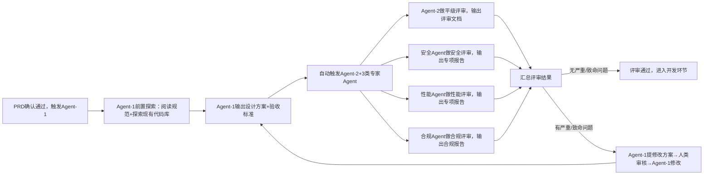

# 模块2：架构设计与多维度评审

## 1. 目标定位

本模块核心解决「需求文档→可落地架构方案」的转化问题，并通过多Agent并行评审确保方案质量。主要解决以下问题：

- 架构设计缺少标准化约束，导致方案质量参差不齐；
- 单一视角评审遗漏安全、性能、合规维度的风险；
- 验收标准不可量化，导致后续验收无法执行；
- 评审流程不规范，修改方向不明确，反复修改耗时。

## 2. 涉及的 Agent

| Agent | 角色 | 职责 |
|-------|------|------|
| Agent-1（高级架构师Agent） | 设计主体 | 基于标准化PRD，设计架构方案与验收标准文档 |
| Agent-2（平级评审Agent） | 评审执行 | 从架构合理性维度评审设计方案，输出评审文档 |
| 安全专家Agent | 专项评审 | 从安全维度评审设计方案，输出安全评审报告 |
| 性能专家Agent | 专项评审 | 从性能维度评审设计方案，输出性能评审报告 |
| 合规专家Agent | 专项评审 | 从合规维度评审设计方案，输出合规评审报告 |
| Agent-7（Backlog整理Agent） | 跟进事项承接 | 汇总各评审Agent写入的「优化」级改进建议，统一排期管理，不干扰当前需求推进 |
| 人类（技术负责人） | 兜底裁决 | 对致命/严重问题提供最终决策，裁决多Agent分歧 |

## 3. 触发前置条件

- 模块1（需求标准化转化）完成：标准化PRD文档已通过人类校验，需求ID已绑定；
- **自动触发**：PRD文档确认通过后，自动触发Agent-1。

## 4. 输入与输出

### 输入

| 输入项 | 来源 | 格式 |
|--------|------|------|
| 标准化PRD文档 | `docs/demand/{需求ID}/PRD.md` | Markdown |
| 项目架构规范 | `docs/ARCHITECTURE.md` | Markdown |
| 编码规范 | `docs/CONVENTIONS.md` | Markdown |
| 测试规范 | `docs/TESTING.md` | Markdown |
| 现有代码库 | 项目根目录 | 源代码 |
| 《方案设计文档编写指南》 | `docs/guide/solution-design-guide.md` | Markdown |
| 《设计方案评审文档编写指南》 | `docs/guide/design-review-guide.md` | Markdown |

### 输出

| 输出物 | 格式 | 归档路径 |
|--------|------|----------|
| 架构设计方案 | Markdown | `docs/demand/{需求ID}/design/architecture-V1.0.0.md` |
| 验收标准文档 | Markdown | `docs/demand/{需求ID}/acceptance/criteria-V1.0.0.md` |
| 平级评审文档 | Markdown | `docs/demand/{需求ID}/review/peer-review-V1.0.0.md` |
| 安全评审报告 | Markdown | `docs/demand/{需求ID}/review/security-review-V1.0.0.md` |
| 性能评审报告 | Markdown | `docs/demand/{需求ID}/review/performance-review-V1.0.0.md` |
| 合规评审报告 | Markdown | `docs/demand/{需求ID}/review/compliance-review-V1.0.0.md` |

### 产出物版本管理与保留规范

本模块所有产出物遵循**追加不覆盖（Append-Only）** 原则与**版本递进规则**：

**关键原则**：

1. **版本号递进规则**：
   - 初始版本：`V1.0.0`（Agent-1首次输出）
   - 评审修改后：`V1.0.1` / `V1.1.0`（根据修改范围选择）
   - 重新评审修改：按递进规则继续升级版本号
   - 版本号绑定：需求ID + 所有文档版本号必须同步递进

2. **历史版本保留**：
   - 旧版设计方案、旧版验收标准需保存至 `docs/demand/{需求ID}/history/`
   - 旧版评审文档（平级/安全/性能/合规）需保存至 `docs/demand/{需求ID}/review/history/`
   - 所有版本的评审意见与修改建议均须保留，不可丢弃

3. **多轮评审的追加规则**：
   - 当出现"评审指出问题→Agent-1修改→重新评审"的循环时，每轮应生成新版本
   - 新版本的评审文档应追加一个"评审轮次"章节，而不覆盖旧评审结论
   - 保留完整的"评审意见→修改→重新评审"的追溯链条

4. **版本对应矩阵**（新增必需产出物）：
   - 生成至 `docs/demand/{需求ID}/design/version-mapping.md`
   - 记录架构方案版本、验收标准版本、各评审文档版本、生成时间、关联关系

### 与其他模块的标准化对接

- **上游（模块1）**：接收标准化PRD文档，需求ID已绑定；
- **下游（模块3）**：评审通过的架构设计方案+验收标准文档，自动触发Agent-3；
- **接口约定**：所有输出文档头部必须包含需求ID、关联架构版本、基准Commit等锚点信息；版本对应关系必须在版本映射表中完整记录。

## 5. 处理流程、校验标准与异常处理

### 5.1 操作步骤（共6步，顺序不可乱）

**第1步（自动触发）**：需求PRD确认通过后，自动触发Agent-1。

**第2步（Agent-1执行前置探索）**：

在输出任何设计内容之前，Agent-1必须按《方案设计文档编写指南》第一章完成三层强制探索（项目背景与现有功能、项目规范文档、现有代码库），并将探索结论记录在设计方案的"需求溯源"和"边界定义"章节中。详见 `docs/guide/solution-design-guide.md` 第一章。

**第3步（Agent-1输出设计文档）**：

1. 基于探索结论，读取标准化PRD、《方案设计文档编写指南》；
2. 输出架构设计方案（含拓扑图、技术选型、核心流程）；
3. 输出验收标准文档（所有指标可量化）；
4. 绑定需求ID、初始版本号（格式：`V1.0.0`）；
5. 提交至代码仓库。

**第4步（自动触发）**：Agent-1提交完成后，自动触发Agent-2（平级评审）和3类专家Agent（安全/性能/合规），同步开展评审。

**第5步（多Agent并行评审）**：

- Agent-2输出平级评审文档；
- 3类专家Agent分别输出专项评审文档；
- 所有评审文档均标注问题分级（致命/严重/一般/优化）；
- **各评审Agent将「优化」级别中不影响当前需求推进的改进建议，同步写入当前需求目录下的 `backlog.md`**，交由Agent-7统一管理，不强制纳入当前版本整改。

**第6步（人类+Agent协同修改）**：

1. Agent-1读取所有评审文档，自动修改"一般"级问题；
2. "优化"级问题：确认是否影响当前需求核心功能——影响则处理，不影响则写入Backlog；
3. "严重/致命"级问题由Agent-1提出修改方案，人类审核确认后，Agent-1完成修改；
4. 重新提交评审，直至所有评审结论为"通过"。

### 5.2 评审流程图（可视化步骤）

### 5.3 校验标准（刚性约束）

- 架构设计方案必须覆盖PRD所有需求，技术选型符合项目级规范（如指定Java语言、MySQL数据库）；
- 验收标准文档必须可自动化执行（所有指标可量化，例："接口响应时间≤500ms"），无模糊验收项；
- 评审通过标准：无致命/严重问题，一般问题≤3个，优化问题不影响核心功能。

### 5.4 异常处理

| 异常场景 | 处置方式 |
|----------|----------|
| 评审出现致命问题（如架构无法满足并发需求） | Agent-1重新设计架构方案，人类全程介入指导，直至评审通过 |
| 多Agent评审出现分歧（如Agent-2与安全Agent意见不一） | 由人类兜底裁决，明确最终方案，记录裁决结果，纳入知识库 |
| 验收标准无法自动化执行 | 退回Agent-1修改，所有指标必须量化，不可保留"模糊验收项" |
| 「优化」级问题过多影响判断 | 区分「影响核心功能」与「不影响但值得改进」：前者纳入当前整改，后者归入Backlog，不得以优化数量多为由拖延评审通过 |

---

## 6. 依赖的指南文档

- **《方案设计文档编写指南》**：`docs/guide/solution-design-guide.md`（供Agent-1使用）
- **《设计方案评审文档编写指南》**：`docs/guide/design-review-guide.md`（供Agent-2使用）

---

## 7. 《方案设计文档编写指南》编写规范

本指南为Agent-1编写架构设计方案时的核心依据，确保方案结构完整、技术描述规范、可直接支撑开发与验收。完整指南见 `docs/guide/solution-design-guide.md`，以下为核心要点摘录。

### 7.1 设计前的强制探索步骤

Agent-1 在写任何一行方案内容之前，必须完成三层强制探索（项目背景与现有功能、项目规范文档、现有代码库）。完整要求详见 `docs/guide/solution-design-guide.md` 第一章。

### 7.2 方案文档必要章节

一份合格的方案文档必须包含《方案设计文档编写指南》第二章要求的全部章节，缺少任何一章都会导致实现时产生歧义。完整章节清单及各章节的作用与缺失后果详见 `docs/guide/solution-design-guide.md` 第二章。

### 7.3 数据结构定义规范

**每个字段必须有统计口径说明**，仅给出字段名和类型是不够的，必须说明：
- 统计范围（全量？某个子集？）
- 数据来源（哪个接口？哪个方法？）
- 边界值处理（为0时返回什么？为负数时如何钳制？）
- 与其他字段的关联约束

**跨模块共享类型的归属原则**：
- 类型是领域实体的自然属性 → 放在领域包
- 类型是基础设施的内部概念 → 放在基础设施包
- 放在任何一方都会造成循环依赖 → 下沉到被双方依赖的低层包

### 7.4 接口设计规范

- 方案中的接口必须给出可直接用于实现的完整签名（含参数类型完整包路径、godoc注释）；
- 批量接口的必要性须在设计阶段评估，不能留给实现者自行决定；
- 存储接口必须明确语义：**upsert**（覆盖写）/ **append**（追加）/ **insert**（幂等插入）；读取接口须说明 key 不存在时的行为。

### 7.5 核心逻辑规范

- 用**伪代码**描述执行顺序，而非文字描述（文字描述容易模糊，伪代码有明确的执行顺序语义）；
- 错误处理策略必须逐一说明：失败时跳过还是终止？失败对后续操作的影响？错误值是否透传？
- 边界条件必须枚举：分母为0、结果为负数、输入集合为空、批量查询结果中某个key不存在。

### 7.6 验收标准（AC）规范

每条AC必须包含：编号（层次化如AC-1.1）、验收条件（一句话描述「什么情况下通过」）、测试用例场景（具体的输入、操作、预期输出）。

必须覆盖的测试维度：正常路径、边界条件、错误路径、并发安全、生命周期、多实例一致性、性能基线。

每组AC须明确：测试文件路径、函数名前缀、执行命令。

---

## 8. 《设计方案评审文档编写指南》编写规范

本指南为Agent-2及3类专家Agent执行设计方案评审时的核心依据，确保评审覆盖全维度、问题描述清晰可执行。

### 8.1 指南核心目录（必含模块，不可遗漏）

1. **文档基础信息**：需求ID、关联设计文档版本、评审时间、评审Agent；
2. **评审基线**：绑定设计文档版本、评审范围、评审标准；
3. **评审维度打分**：架构合理性、可扩展性、安全性、可落地性（满分100分，80分及以上通过）；
4. **问题分级明细**：
   - 致命/严重/一般/优化四级；
   - 每条问题须包含：原文引用、风险说明、修改建议；
5. **评审结论**：通过/不通过，不通过需注明核心原因；
6. **评审追溯**：评审Agent签名、复核人签名、评审记录归档路径。

### 8.2 问题分级标准

评审问题按致命/严重/一般/优化四级分级，各级的判定标准与处置要求详见 `docs/guide/design-review-guide.md` 第六章 6.1 节。

## 9. 模块输出验收标准

本模块完成的验收标准：

- [ ] 架构设计方案存在于 `docs/demand/{需求ID}/design/architecture-V1.0.0.md`；
- [ ] 验收标准文档存在于 `docs/demand/{需求ID}/acceptance/criteria-V1.0.0.md`；
- [ ] 所有评审文档（平级+3类专项）已归档至 `docs/demand/{需求ID}/review/`；
- [ ] 评审结论均为"通过"，无致命/严重遗留问题；
- [ ] 所有文档头部包含完整锚点字段（需求ID、关联架构版本、基准Commit）；
- [ ] 验收标准所有指标均已量化，无模糊表述；
- [ ] 产出物版本对应矩阵已生成至 `docs/demand/{需求ID}/design/version-mapping.md`，记录各版本的生成时间、关联关系、评审结论；
- [ ] 若存在多轮迭代，旧版本文件已保存至 history/ 目录，版本号格式统一（如 `architecture-V1.0.0.md` / `criteria-V1.0.0.md`）；
- [ ] 各评审文档版本号与设计方案版本号保持同步，无版本不一致现象。
