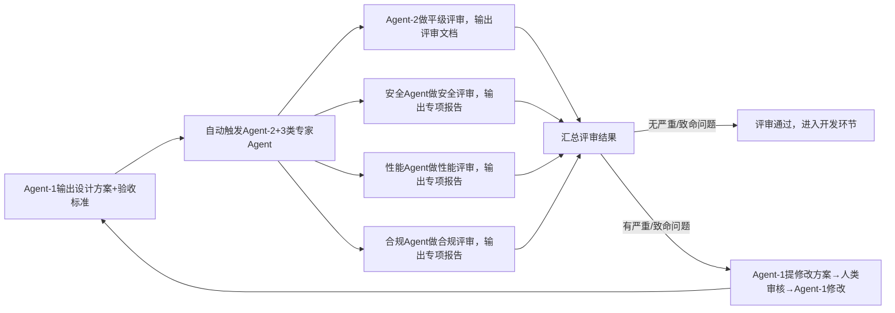

# 模块2：架构设计与多维度评审

## 1. 目标定位

本模块核心解决「需求文档→可落地架构方案」的转化问题，并通过多Agent并行评审确保方案质量。主要解决以下问题：

- 架构设计缺少标准化约束，导致方案质量参差不齐；
- 单一视角评审遗漏安全、性能、合规维度的风险；
- 验收标准不可量化，导致后续验收无法执行；
- 评审流程不规范，修改方向不明确，反复修改耗时。

## 2. 涉及的 Agent

| Agent | 角色 | 职责 |
|-------|------|------|
| Agent-1（高级架构师Agent） | 设计主体 | 基于标准化PRD，设计架构方案与验收标准文档 |
| Agent-2（平级评审Agent） | 评审执行 | 从架构合理性维度评审设计方案，输出评审文档 |
| 安全专家Agent | 专项评审 | 从安全维度评审设计方案，输出安全评审报告 |
| 性能专家Agent | 专项评审 | 从性能维度评审设计方案，输出性能评审报告 |
| 合规专家Agent | 专项评审 | 从合规维度评审设计方案，输出合规评审报告 |
| 人类（技术负责人） | 兜底裁决 | 对致命/严重问题提供最终决策，裁决多Agent分歧 |

## 3. 触发前置条件

- 模块1（需求标准化转化）完成：标准化PRD文档已通过人类校验，需求ID已绑定；
- **自动触发**：PRD文档确认通过后，自动触发Agent-1。

## 4. 输入与输出

### 输入

| 输入项 | 来源 | 格式 |
|--------|------|------|
| 标准化PRD文档 | `docs/demand/{需求ID}/PRD.md` | Markdown |
| 《方案设计文档编写指南》 | `docs/guide/solution-design-guide.md` | Markdown |
| 《设计方案评审文档编写指南》 | `docs/guide/design-review-guide.md` | Markdown |

### 输出

| 输出物 | 格式 | 归档路径 |
|--------|------|----------|
| 架构设计方案 | Markdown | `docs/demand/{需求ID}/design/architecture-V1.0.0.md` |
| 验收标准文档 | Markdown | `docs/demand/{需求ID}/acceptance/criteria-V1.0.0.md` |
| 平级评审文档 | Markdown | `docs/demand/{需求ID}/review/peer-review-V1.0.0.md` |
| 安全评审报告 | Markdown | `docs/demand/{需求ID}/review/security-review-V1.0.0.md` |
| 性能评审报告 | Markdown | `docs/demand/{需求ID}/review/performance-review-V1.0.0.md` |
| 合规评审报告 | Markdown | `docs/demand/{需求ID}/review/compliance-review-V1.0.0.md` |

### 与其他模块的标准化对接

- **上游（模块1）**：接收标准化PRD文档，需求ID已绑定；
- **下游（模块3）**：评审通过的架构设计方案+验收标准文档，自动触发Agent-3；
- **接口约定**：所有输出文档头部必须包含需求ID、关联架构版本、基准Commit等锚点信息。

## 5. 处理流程、校验标准与异常处理

### 5.1 操作步骤（共5步，顺序不可乱）

**第1步（自动触发）**：需求PRD确认通过后，自动触发Agent-1。

**第2步（Agent-1执行）**：

1. 读取标准化PRD、《方案设计文档编写指南》；
2. 输出架构设计方案（含拓扑图、技术选型、核心流程）；
3. 输出验收标准文档（所有指标可量化）；
4. 绑定需求ID、初始版本号（格式：`V1.0.0`）；
5. 提交至代码仓库。

**第3步（自动触发）**：Agent-1提交完成后，自动触发Agent-2（平级评审）和3类专家Agent（安全/性能/合规），同步开展评审。

**第4步（多Agent并行评审）**：

- Agent-2输出平级评审文档；
- 3类专家Agent分别输出专项评审文档；
- 所有评审文档均标注问题分级（致命/严重/一般/优化）。

**第5步（人类+Agent协同修改）**：

1. Agent-1读取所有评审文档，自动修改"一般/优化"级问题；
2. "严重/致命"级问题由Agent-1提出修改方案，人类审核确认后，Agent-1完成修改；
3. 重新提交评审，直至所有评审结论为"通过"。

### 5.2 评审流程图（可视化步骤）

### 5.3 校验标准（刚性约束）

- 架构设计方案必须覆盖PRD所有需求，技术选型符合项目级规范（如指定Java语言、MySQL数据库）；
- 验收标准文档必须可自动化执行（所有指标可量化，例："接口响应时间≤500ms"），无模糊验收项；
- 评审通过标准：无致命/严重问题，一般问题≤3个，优化问题不影响核心功能。

### 5.4 异常处理

| 异常场景 | 处置方式 |
|----------|----------|
| 评审出现致命问题（如架构无法满足并发需求） | Agent-1重新设计架构方案，人类全程介入指导，直至评审通过 |
| 多Agent评审出现分歧（如Agent-2与安全Agent意见不一） | 由人类兜底裁决，明确最终方案，记录裁决结果，纳入知识库 |
| 验收标准无法自动化执行 | 退回Agent-1修改，所有指标必须量化，不可保留"模糊验收项" |

---

## 6. 依赖的指南文档

- **《方案设计文档编写指南》**：`docs/guide/solution-design-guide.md`（供Agent-1使用）
- **《设计方案评审文档编写指南》**：`docs/guide/design-review-guide.md`（供Agent-2使用）

---

## 7. 《方案设计文档编写指南》编写规范

本指南为Agent-1编写架构设计方案时的核心依据，确保方案结构完整、技术描述规范、可直接支撑开发与验收。

### 7.1 指南核心目录（必含模块，不可遗漏）

1. **文档基础信息**：需求ID、关联版本、基准Commit、生效时间；
2. **需求溯源**：关联标准化PRD ID、核心业务目标、需求优先级；
3. **边界定义**：明确"做什么、不做什么"，无模糊表述；
4. **整体架构**：架构拓扑图、模块拆分、数据流图（可视化）；
5. **技术选型**：框架、存储、中间件，明确选型理由，符合项目级规范；
6. **核心数据结构**：数据库表设计、核心实体类、接口契约；
7. **非功能设计**：性能、安全、容灾、兼容要求（可量化）；
8. **风险预案**：潜在风险、应对措施、责任人；
9. **附录**：术语定义、依赖清单、参考文档。

---

## 8. 《设计方案评审文档编写指南》编写规范

本指南为Agent-2及3类专家Agent执行设计方案评审时的核心依据，确保评审覆盖全维度、问题描述清晰可执行。

### 8.1 指南核心目录（必含模块，不可遗漏）

1. **文档基础信息**：需求ID、关联设计文档版本、评审时间、评审Agent；
2. **评审基线**：绑定设计文档版本、评审范围、评审标准；
3. **评审维度打分**：架构合理性、可扩展性、安全性、可落地性（满分100分，80分及以上通过）；
4. **问题分级明细**：
   - 致命/严重/一般/优化四级；
   - 每条问题须包含：原文引用、风险说明、修改建议；
5. **评审结论**：通过/不通过，不通过需注明核心原因；
6. **评审追溯**：评审Agent签名、复核人签名、评审记录归档路径。

### 8.2 问题分级标准

| 问题级别 | 判定标准 | 处置要求 |
|----------|----------|----------|
| 致命 | 架构根本无法满足需求，或存在数据安全风险 | 必须修改，修改前不可进入开发 |
| 严重 | 严重影响核心功能或性能指标 | 必须修改，限期整改（48小时内） |
| 一般 | 影响代码可维护性或边缘场景 | 建议修改，纳入当前版本整改 |
| 优化 | 有更优实现方案，但当前方案可落地 | 可选修改，不强制 |

## 9. 模块输出验收标准

本模块完成的验收标准：

- [ ] 架构设计方案存在于 `docs/demand/{需求ID}/design/architecture-V1.0.0.md`；
- [ ] 验收标准文档存在于 `docs/demand/{需求ID}/acceptance/criteria-V1.0.0.md`；
- [ ] 所有评审文档（平级+3类专项）已归档至 `docs/demand/{需求ID}/review/`；
- [ ] 评审结论均为"通过"，无致命/严重遗留问题；
- [ ] 所有文档头部包含完整锚点字段（需求ID、关联架构版本、基准Commit）；
- [ ] 验收标准所有指标均已量化，无模糊表述。
