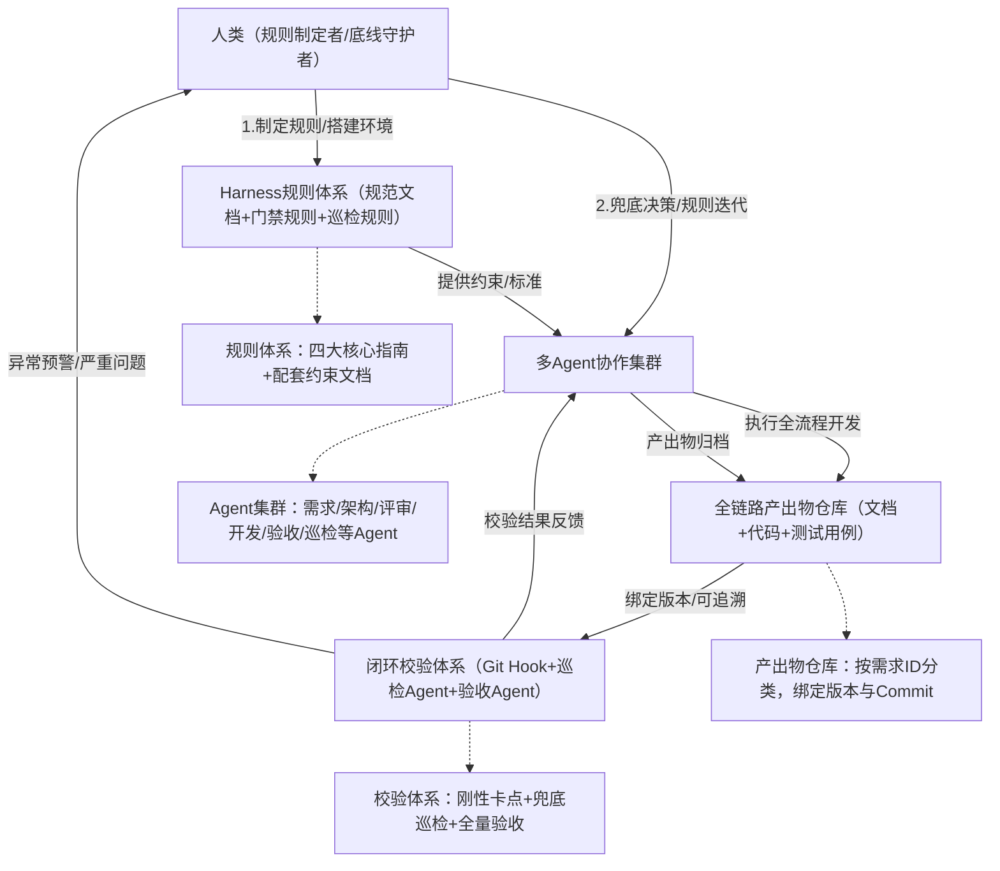

# 全局架构总览

## 前言（落地定位与核心约定）

本文核心定位：**可直接落地的多Agent软件开发实践方案**，基于Agent Harness Engineering（智能体驾驭工程）顶层思想，聚焦「人类制定驾驭规则、多Agent在约束框架内完成全流程开发」的上层落地，不拆解Agent底层运行基座（上下文管理、状态持久化、工具调度、熵收敛等能力均由Agent内生承载）。

本文核心目标：让任何用户（技术管理者、开发工程师）均可按照「全局架构→模块细节→操作步骤→规范文档」的顺序，一步步复刻整套实践方案，无模糊点、无遗漏项、无歧义，所有环节明确「执行主体、操作标准、校验规则、输出物要求」。

核心约定（统一认知，避免落地偏差）：

- 执行主体：人类（规则制定者、环境搭建者、底线守护者）、多智能体（具体执行角色，下文明确分工）；
- 规则载体：所有驾驭规则、校验标准均以「规范文档」形式固化，纳入项目规则库，可直接复用；
- 触发机制：所有流程节点均有明确触发条件（手动触发/自动触发），无"默认执行"模糊表述；
- 校验原则：刚性约束（必须通过，否则阻断流程）+ 柔性评审（优化建议，不阻断）结合；
- 产出物要求：所有Agent/人类产出物均有固定格式、版本规则、归档路径，确保可追溯、可复用。

## 1.1 核心思想与全局逻辑

本文实践方案的核心逻辑是 **"人定驾驭规则→Agent受控执行→全链路闭环校验→熵收敛治理"**，完全贴合Agent Harness Engineering"以约束控自主、以规则降风险"的核心思想，打破传统岗位分割壁垒，实现软件开发全流程自动化、标准化、可落地。

核心逻辑拆解：

- 人类：不参与具体执行，仅负责制定规则、搭建环境、兜底决策、迭代规则；
- Agent：在人类制定的规则框架内，分工完成需求转化、架构设计、开发实现、评审验收等全流程执行工作；
- 约束体系：通过规范文档、门禁校验、巡检机制，确保Agent执行不越界、产出不偏离；
- 闭环逻辑：需求→设计→开发→验收→反馈→迭代，每一步均有校验、有记录、可追溯。

**关于规约体系的动态演进观**：规约指南体系并非一成不变的静态文档集合，而是随模型与Agent能力持续演进的动态框架。当前阶段，规范文档承担着"外化约束"的核心职能——将人类经验、业务判断、质量标准显式化，以弥补Agent在特定领域的能力短板。随着模型能力的迭代提升，部分指南规则会被Agent内化为默认行为（如代码风格校验、文档格式规范等），无需显式约束即可自动达标；届时，对应的规范文档可逐步简化乃至退出规则库。**因此，规约体系的"减重"是能力演进的自然结果，而非目标本身——当前阶段的合理做法，是让规约足够清晰、可执行，同时保持对Agent能力边界的持续观察，及时精简已被内化的规则，聚焦仍需外部约束的高价值环节。**

## 1.2 全局架构图（可视化理解）

以下架构图明确各角色、各模块的关联关系，落地前需先明确该架构，确保各环节衔接无偏差：

## 1.3 多Agent角色分工（明确谁来做，做什么）

所有Agent角色均有明确职责、输入输出要求，无模糊分工，落地时直接按以下角色配置即可：

| Agent角色 | 核心职责 | 输入（触发条件） | 输出物（固定格式） | 执行约束 |
|---|---|---|---|---|
| Agent-0（需求校准Agent） | 将人类口语化需求转化为标准化结构化需求文档 | 人类口语化需求（文字/语音转文字）、《需求校准指南》 | 标准化PRD文档（含需求ID、业务边界、非功能指标） | 严格遵循《需求校准指南》，不可新增/遗漏需求要点 |
| Agent-1（高级架构师Agent） | 基于标准化PRD，设计架构方案与验收标准 | Agent-0输出的标准化PRD、《方案设计文档编写指南》 | 架构设计方案、验收标准文档（绑定需求ID、初始版本号） | 方案需覆盖所有需求要点，符合项目级技术规范 |
| Agent-2（平级评审Agent） | 评审Agent-1的架构方案与验收标准，提出修改建议 | Agent-1输出的设计方案+验收标准、《设计方案评审指南》 | 评审文档（含问题分级、修改建议、评审结论） | 问题分级需符合"致命/严重/一般/优化"四级标准 |
| Agent-3（高级开发Agent） | 对齐设计方案，编写代码、预埋单元测试 | 评审通过的设计方案+验收标准、《设计方案对齐指南》 | 全量代码、单元测试用例、对齐确认文档（绑定Commit） | 代码需符合编码规范，单测通过率需达到预设阈值（如90%） |
| Agent-4（验收Agent） | 依据验收标准，执行全维度自动化验收测试 | Agent-3输出的代码+测试用例、验收标准文档 | 验收报告（含测试结果、不通过项、整改建议） | 验收需覆盖所有业务/接口/性能/安全场景，无遗漏 |
| 专家Agent（3类） | 补充评审，覆盖安全、性能、合规维度 | Agent-1的设计方案、Agent-3的代码 | 专项评审报告（安全/性能/合规各1份） | 严格遵循各专项评审规则，聚焦对应维度风险 |
| Agent-5（文档熵收敛巡检Agent） | 校验文档与代码的版本联动、锚点一致性，收敛熵增 | 全链路产出物、《文档熵收敛巡检检查指南》 | 巡检报告（含差异项、整改建议、分级预警） | 每日全量扫描+主干合并后增量扫描，不遗漏异常 |

## 1.4 全局落地前置条件（必做，否则无法推进）

落地前需完成以下4项前置工作，所有工作均由人类执行，明确操作标准，确保无遗漏：

1. **环境搭建**：搭建Agent运行沙箱（隔离外部环境，避免风险）、代码仓库（配置Git Hook）、产出物仓库（按需求ID分类归档），权限配置为"人类拥有最高权限，Agent仅拥有执行/提交权限，无删除/篡改权限"；

2. **规则文档准备**：编写并评审通过本文所有配套规范文档（四大核心指南+3类配套约束文档），上传至产出物仓库"规则库"目录，确保所有Agent可访问、可解析；

3. **Agent配置**：将所有Agent角色（Agent-0至Agent-5）配置完成，绑定对应规范文档（如Agent-0绑定《需求校准指南》），设置触发条件（如Agent-0由人类手动触发）；

4. **基线标准确定**：明确核心基线阈值（如单测通过率≥90%、验收通过率100%方可合并代码），录入门禁规则与巡检规则，确保刚性约束可落地。

## 关于规约定制化原则

本框架提供的所有规范文档均为通用模板，落地时**必须结合当前项目的实际情况进行定制化**。定制化的核心原则是：**对当前项目高度可泛化，对其他项目可参考**——即指南内容需与项目的技术栈、团队规模、业务特点、质量基线深度绑定，确保每一条规则在本项目内均可直接执行、无需二次解读。具体而言，定制化时需重点关注以下几点：

- **技术栈绑定**：将通用表述（如"遵循项目编码规范"）替换为具体约束（如"使用 Java 17 + Spring Boot 3.x，命名遵循 Google Java Style Guide"）；
- **质量阈值校准**：根据项目实际情况校准基线数值（如单测覆盖率阈值、接口响应时间上限），避免照搬示例数字；
- **流程裁剪**：对于规模较小的项目，可合并或简化部分评审环节（如安全/性能/合规三类专家Agent可合并为一个），但核心校验逻辑不可省略；
- **术语统一**：将文档中的通用术语替换为团队已有的业务术语，降低理解成本，避免概念混淆。
